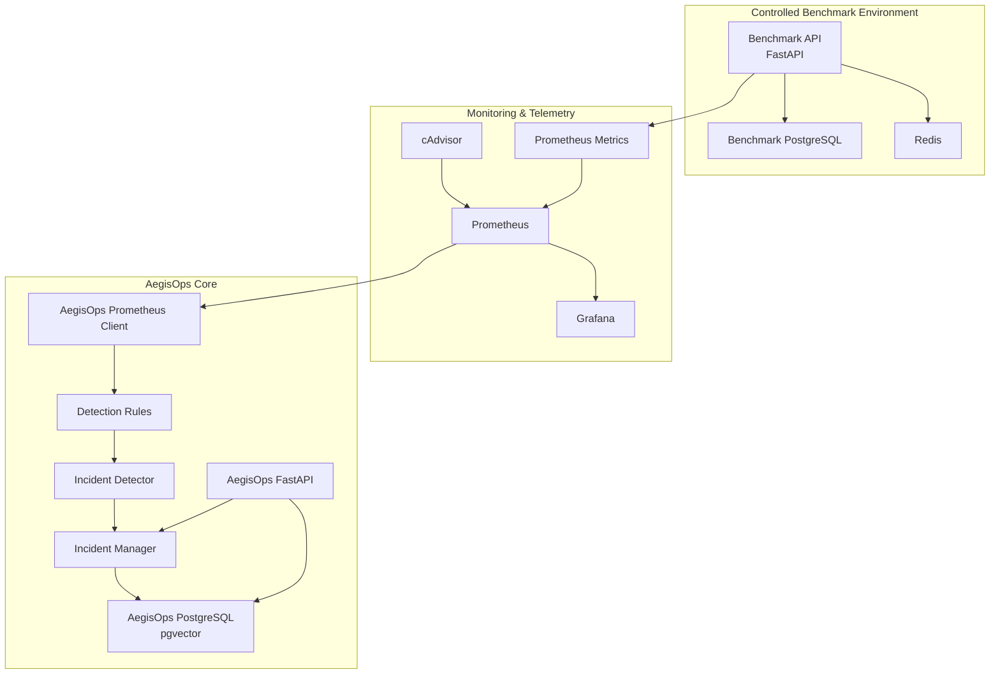

# AegisOps

AegisOps is a modular AI-powered incident operations platform being built to detect service failures, investigate evidence, identify root causes, request human approval for remediation, execute permitted recovery actions, verify recovery, and generate reusable postmortems.

The project is being developed incrementally so each architectural layer is understood before higher-level orchestration and AI reasoning are added.

> **Current status:** Phase 3 complete — Incident Detection Engine
> **Next phase:** Phase 4 — Advanced Workflow Orchestration

---

## Current Architecture



The benchmark environment is deliberately separate from the AegisOps core. It produces controlled failures and telemetry; AegisOps consumes that telemetry and stores its own incident state independently.

All local infrastructure services are currently managed through the root `docker-compose.yml`, while the AegisOps FastAPI backend runs locally during development.

---

## Completed Phases

| Phase | Status | Outcome |
|---|---|---|
| Phase 0 — Project Foundation | ✅ Complete | Git/GitHub, FastAPI, PostgreSQL, pgvector, Docker, Compose, configuration, DB connectivity |
| Phase 1 — Benchmark Environment | ✅ Complete | Breakable FastAPI target with dedicated PostgreSQL, Redis, real operations, and controlled failures |
| Phase 2 — Monitoring & Telemetry | ✅ Complete | Prometheus, cAdvisor, Grafana, HTTP metrics, latency, 5xx rate, dependency health, container telemetry |
| Phase 3 — Incident Detection Engine | ✅ Complete | Prometheus ingestion, deterministic rules, severity, incident persistence, deduplication, automatic resolution |
| Phase 4 — Advanced Workflow Orchestration | ⏳ Next | n8n workflows, webhooks, branching, retries, waits, and orchestration around incident events |

Detailed phase documentation is available under:

```text
docs/phases/
```

---

## Phase 2 — Monitoring Foundation

Phase 2 established the telemetry layer that Phase 3 now consumes.

The Grafana dashboard provides visibility into dependency availability, HTTP throughput, HTTP 5xx rate, and P95 request latency.


This monitoring layer remains intentionally separate from incident reasoning. Prometheus is the source of time-series data, while Grafana is used for human visualization.

---

## Phase 3 — Telemetry Becomes Incidents

Phase 3 connects the AegisOps core directly to Prometheus.

The detector currently evaluates four rule types:

```text
PostgreSQL unavailable
Redis unavailable
HTTP 5xx rate elevated
P95 latency elevated
```

During verification, Grafana showed the same underlying telemetry AegisOps was consuming: a benchmark PostgreSQL outage and recovery, controlled error traffic, and artificial latency.


The important separation is:

```text
Prometheus = telemetry source
Grafana    = visualization
AegisOps   = incident detection and state
```

---

## Phase 3 — Incident Lifecycle

Triggered rules become durable PostgreSQL incident records with severity, timestamps, trigger values, thresholds, and state.

AegisOps updates an existing open incident instead of generating duplicate records on every polling cycle.


The verified lifecycle is:

```text
healthy telemetry
      ↓
threshold crossed
      ↓
OPEN incident
      ↓
condition persists
      ↓
same incident updated
      ↓
telemetry recovers
      ↓
RESOLVED
```

This is still deterministic detection, not AI diagnosis. Root-cause reasoning is intentionally reserved for later phases.

---

## Repository Structure

```text
AegisOps/
│
├── backend/
│   ├── app/
│   │   ├── core/
│   │   │   └── config.py
│   │   ├── db/
│   │   │   └── database.py
│   │   ├── incidents/
│   │   │   ├── __init__.py
│   │   │   ├── detector.py
│   │   │   ├── manager.py
│   │   │   ├── repository.py
│   │   │   ├── routes.py
│   │   │   ├── rules.py
│   │   │   └── worker.py
│   │   ├── monitoring/
│   │   │   ├── __init__.py
│   │   │   └── prometheus.py
│   │   └── main.py
│   ├── sql/
│   │   └── 001_create_incidents.sql
│   ├── tests/
│   ├── requirements.txt
│   └── requirements-dev.txt
│
├── benchmark/
│   ├── app/
│   │   └── main.py
│   ├── Dockerfile
│   └── requirements.txt
│
├── monitoring/
│   ├── prometheus.yml
│   └── grafana/
│       └── provisioning/
│           └── datasources/
│               └── prometheus.yml
│
├── docs/
│   ├── phases/
│   │   ├── phase-00-project-foundation.md
│   │   ├── phase-01-benchmark-environment.md
│   │   ├── phase-02-monitoring-telemetry.md
│   │   └── phase-03-incident-detection-engine.md
│   └── screenshots/
│       ├── phase 2/
│       │   ├── grafana.png
│       │   └── stack-running.png
│       └── phase 3/
│           ├── grafana.png
│           └── incidents.png
│
├── .env.example
├── .gitignore
├── docker-compose.yml
└── README.md
```

---

## Core Technologies

### Current

- Python 3.12
- FastAPI
- Uvicorn
- PostgreSQL 16
- pgvector
- Redis
- psycopg
- httpx
- Docker
- Docker Compose
- Prometheus
- cAdvisor
- Grafana

### Planned Later

- n8n
- Gemini
- LangGraph
- SentenceTransformers
- RAG
- Slack / Discord notifications where useful
- AWS
- Terraform

Technologies are introduced only when their phase has a real architectural need.

---

## AegisOps Backend

Current core endpoints include:

```text
GET  /health
GET  /ready
GET  /incidents
POST /incidents/detect
```

`/health` confirms that the FastAPI process is alive.

`/ready` confirms that the AegisOps backend can reach its own PostgreSQL dependency.

`GET /incidents` returns stored incident history.

`POST /incidents/detect` manually runs one detection cycle for testing and debugging. Normal detection is performed automatically by the background worker.

---

## Incident Detection Rules

Current deterministic rules:

| Rule | Threshold | Severity |
|---|---:|---|
| PostgreSQL unavailable | dependency value `== 0` | HIGH |
| Redis unavailable | dependency value `== 0` | HIGH |
| HTTP 5xx rate high | `> 0.05 req/s` | MEDIUM |
| API P95 latency high | `> 2.0 s` | MEDIUM |

Rules define measurable unhealthy conditions. They do not hardcode root-cause conclusions.

---

## Incident State & Deduplication

The current incident lifecycle is intentionally small:

```text
OPEN
RESOLVED
```

A fingerprint based on:

```text
service + rule_key
```

identifies an active incident.

Example:

```text
benchmark-redis:redis_unavailable
```

While that incident remains open, future detection cycles update `last_seen_at` and the current trigger value instead of inserting duplicates.

A database-level partial unique index reinforces the same invariant.

---

## Benchmark API

The benchmark environment currently exposes:

```text
GET  /health
GET  /ready
POST /items
GET  /items
GET  /activity
GET  /simulate/error
GET  /simulate/slow
GET  /metrics
```

The benchmark can currently simulate:

- PostgreSQL outage
- Redis outage
- HTTP 500 errors
- artificial API latency

These controlled failures provide known test conditions for AegisOps without coupling incident logic to a production application.

---

## Monitoring Metrics

Custom benchmark metrics include:

```text
benchmark_http_requests_total
benchmark_http_request_duration_seconds
benchmark_dependency_up
```

Prometheus also receives container telemetry through cAdvisor.

Prometheus scrapes:

```text
benchmark-api:8000/metrics
cadvisor:8080/metrics
```

AegisOps now queries Prometheus directly through its HTTP API for incident detection.

---

## Configuration

Important local configuration now includes:

```env
POSTGRES_PORT=5432
PROMETHEUS_URL=http://127.0.0.1:9090
INCIDENT_DETECTION_INTERVAL_SECONDS=10
```

The shared PostgreSQL default remains `5432`. Developers can override it in their local `.env` when the port is already in use.

---

## Local Services

Typical local endpoints:

```text
AegisOps backend      http://127.0.0.1:8000
Benchmark API         http://127.0.0.1:8001
cAdvisor              http://127.0.0.1:8080
Prometheus            http://127.0.0.1:9090
Grafana               http://127.0.0.1:3000
```

---

## Quick Start

Create a local environment file:

```powershell
Copy-Item .env.example .env
```

Start the Docker environment:

```powershell
docker compose up -d --build
```

Check service status:

```powershell
docker compose ps
```

Activate the backend environment and start FastAPI:

```powershell
cd backend
.\venv\Scripts\Activate.ps1
pip install -r requirements.txt
uvicorn app.main:app --reload
```

The incident detector starts automatically with the FastAPI application.

---

## Development Approach

AegisOps is intentionally being built phase by phase.

The project follows a few rules:

- introduce a technology only when a phase genuinely needs it
- keep the benchmark system separate from the AegisOps core
- avoid hardcoded diagnoses
- use deterministic logic where deterministic logic is the better tool
- keep remediation human-approved
- gather objective evidence before AI reasoning
- prefer meaningful end-of-phase verification over excessive micro-testing
- document each completed phase with architecture, verification evidence, lessons, and representative screenshots

---

## Documentation

Detailed implementation notes:

- [Phase 0 — Project Foundation](docs/phases/phase-00-project-foundation.md)
- [Phase 1 — Benchmark Environment](docs/phases/phase-01-benchmark-environment.md)
- [Phase 2 — Monitoring & Telemetry](docs/phases/phase-02-monitoring-telemetry.md)
- [Phase 3 — Incident Detection Engine](docs/phases/phase-03-incident-detection-engine.md)

---

## Current Milestone

AegisOps can now:

```text
run a controlled target system
        ↓
produce repeatable failures
        ↓
collect application and container telemetry
        ↓
store time-series evidence in Prometheus
        ↓
visualize behavior in Grafana
        ↓
query telemetry from the AegisOps core
        ↓
evaluate deterministic incident rules
        ↓
persist OPEN incidents
        ↓
deduplicate repeated detections
        ↓
automatically RESOLVE incidents after recovery
```

The next milestone is **Phase 4 — Advanced Workflow Orchestration**, where n8n will begin coordinating workflows around incidents rather than AegisOps simply storing them.
