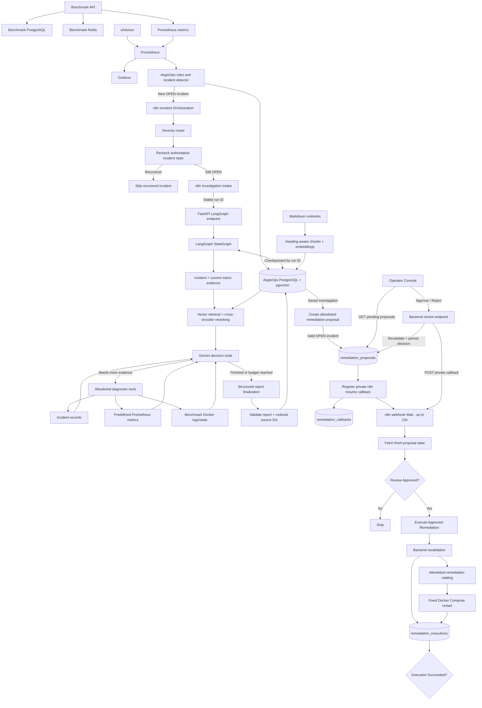

# AegisOps

AegisOps is a modular AI-powered incident operations platform being built to detect service failures, investigate evidence, identify root causes, request human approval for remediation, execute permitted recovery actions, verify recovery, and generate reusable postmortems.

The project is developed incrementally so each architectural layer is understood before higher-level orchestration and AI reasoning are added.

> **Current status:** Phase 12 complete — Automated Remediation
> **Next phase:** Phase 13 — Recovery Verification
> **Roadmap:** 13 of 21 phases complete (Phases 0–12)

---

## Current Architecture



The benchmark environment is deliberately separate from the AegisOps core. It produces controlled failures and telemetry; AegisOps consumes that telemetry and stores incident, investigation, proposal, approval, callback and execution state independently.

The remediation boundary is deliberately strict:

```text
AI proposes.
Human approves.
Backend validates.
Backend executes only a predefined action.
```

n8n orchestrates the workflow and sleeps while waiting for a human decision, but backend state remains authoritative. The current `/operator` page is a temporary approval interface; Phase 15 can replace it with the final dashboard without changing the backend/n8n approval contract.

---

## Completed Phases

| Phase | Status | Outcome |
|---|---|---|
| Phase 0 — Project Foundation | ✅ Complete | Git/GitHub, FastAPI, PostgreSQL, pgvector, Docker, Compose, configuration, DB connectivity |
| Phase 1 — Benchmark Environment | ✅ Complete | Breakable FastAPI target with dedicated PostgreSQL, Redis, real operations, and controlled failures |
| Phase 2 — Monitoring & Telemetry | ✅ Complete | Prometheus, cAdvisor, Grafana, HTTP metrics, latency, 5xx rate, dependency health, container telemetry |
| Phase 3 — Incident Detection Engine | ✅ Complete | Prometheus ingestion, deterministic rules, severity, incident persistence, deduplication, automatic resolution |
| Phase 4 — Advanced Workflow Orchestration | ✅ Complete | Production webhook, severity routing, live incident recheck, timed handling, retries, recovery skip, and shared investigation intake |
| Phase 5 — LLM Investigation v1 | ✅ Complete | Gemini structured hypotheses, Prometheus evidence snapshot, PostgreSQL report history, n8n investigation hand-off |
| Phase 6 — Embeddings & Knowledge Base | ✅ Complete | CPU-based 384-dimensional embeddings, pgvector schema, duplicate-safe sample/Markdown ingestion and six stored documents |
| Phase 7 — RAG Pipeline | ✅ Complete | Heading-aware chunks, pgvector retrieval, top context selection, Gemini context and validated source references |
| Phase 8 — Reranking & Context Engineering | ✅ Complete | Local cross-encoder reranking, duplicate-free context, excerpt budget and persisted similarity/rerank scores |
| Phase 9 — Tool Calling Layer | ✅ Complete | Read-only incident/metric/log tools, validated allowlists, bounded Gemini tool loop and controlled multi-tool investigation |
| Phase 10 — LangGraph Investigation Agent | ✅ Complete | Stateful evidence/RAG graph, conditional tool loop, PostgreSQL checkpointing, budget-aware persistence and n8n integration |
| Phase 11 — Human-in-the-Loop Remediation | ✅ Complete | Allowlisted recovery proposals, auditable review decisions, authenticated human approval and tested approve/reject paths |
| Phase 12 — Automated Remediation | ✅ Complete | Backend-controlled execution, callback-driven human approval, audited execution records, Redis restart verification and idempotent retry protection |
| Phase 13 — Recovery Verification | ⏳ Next | Independently verify post-remediation recovery using existing monitoring rules and Prometheus evidence |

Detailed phase documentation is available under:

```text
docs/phases/
```

---

## Phase 2 — Monitoring Foundation

Phase 2 established the telemetry layer consumed by the incident detector.

Prometheus collects benchmark application metrics and cAdvisor container telemetry, while Grafana provides human-facing visualization.


```text
Prometheus = telemetry source
Grafana    = visualization
AegisOps   = incident detection and state
```

---

## Phase 3 — Incident Detection Engine

AegisOps converts deterministic Prometheus rule violations into durable PostgreSQL incidents.

Current rule families include:

```text
PostgreSQL unavailable
Redis unavailable
HTTP 5xx rate elevated
P95 latency elevated
```

A fingerprint based on `service + rule_key` prevents duplicate OPEN incidents. Persistent unhealthy telemetry updates the existing incident; recovered telemetry transitions it to `RESOLVED`.


---

## Phase 4 — Real Incident Orchestration

AegisOps notifies n8n once when a new incident is created. n8n routes by severity and rechecks authoritative incident state before investigation.

Recovered incidents take the skip path:


Active incidents proceed into the shared Investigation Intake workflow:


See [Phase 4 implementation and verification](docs/phases/phase-04-workflow-orchestration.md).

---

## Phase 5 — Evidence-Grounded LLM Investigation

AegisOps turns an OPEN incident into a structured preliminary investigation. The backend collects current evidence, asks Gemini for observations, hypotheses, missing evidence and suggested checks, validates the response and stores it in PostgreSQL.


Saved investigations can be retrieved without another Gemini call.

See [Phase 5 implementation and verification](docs/phases/phase-05-llm-investigation.md).

---

## Phase 6 — Embeddings & Knowledge Base

Phase 6 introduced a local knowledge store using SentenceTransformers and pgvector. Runbooks and sample documents are stored with normalized 384-dimensional embeddings and stable source keys.


See [Phase 6 implementation and verification](docs/phases/phase-06-embeddings-knowledge-base.md).

---

## Phase 7 — RAG Pipeline

Runbooks are split into heading-aware chunks and stored with local embeddings. Incident context is embedded and searched through pgvector before Gemini is called.


Returned `runbook_source_ids` are validated against the retrieved source IDs.


See [Phase 7 implementation and verification](docs/phases/phase-07-rag-pipeline.md).

---

## Phase 8 — Reranking & Context Engineering

A local cross-encoder reranks vector-search candidates so the final context is ordered by task relevance rather than vector similarity alone.


The context builder keeps a bounded, duplicate-free set of excerpts and stores both retrieval and rerank scores.


See [Phase 8 implementation and verification](docs/phases/phase-08-context-engineering.md).

---

## Phase 9 — Controlled Tool Calling

Gemini can request additional evidence only through a fixed read-only dispatcher.

Allowlisted tools cover:

```text
incident records
predefined Prometheus metrics
benchmark Docker logs/state
```

The tool loop is bounded by execution-round and total-call limits.


See [Phase 9 implementation and verification](docs/phases/phase-09-tool-calling-layer.md).

---

## Phase 10 — Checkpointed LangGraph Investigation Agent

Phase 10 replaced the manually managed tool loop with a checkpointed LangGraph StateGraph.

The graph:

```text
collects evidence
→ retrieves/reranks runbooks
→ asks Gemini whether more evidence is needed
→ executes allowlisted tools
→ loops conditionally
→ finalizes and persists a structured report
```


A fresh Redis incident was successfully routed through n8n into the LangGraph endpoint, and stable run IDs support checkpoint reuse.


See [Phase 10 implementation and verification](docs/phases/phase-10-langgraph-investigation-agent.md).

---

## Phase 11 — Human-in-the-Loop Remediation

Phase 11 created the authorization boundary between investigation and action.

The backend can create a `PENDING` remediation proposal only for an OPEN incident with a matching saved investigation and an allowlisted action/target pair.


The original implementation used a Basic Auth-protected n8n form. Approve and reject paths were both verified, and the backend stored reviewer, timestamp and review note.


Phase 12 subsequently moved the human-facing approval surface out of the n8n form while preserving backend-authoritative review state.

See [Phase 11 implementation and safety boundaries](docs/phases/phase-11-human-in-the-loop-remediation.md).

---

## Phase 12 — Automated Remediation

Phase 12 turns an approved proposal into a controlled infrastructure action.

### Backend-controlled execution

The execution endpoint:

```text
POST /remediations/proposals/{proposal_id}/execute
```

requires `X-AegisOps-Execution-Key`.

For a new execution, FastAPI revalidates the proposal, authorization window, incident state, allowlisted action and exact target before invoking the fixed remediation executor.

Gemini and n8n never provide arbitrary shell commands.

### Operator Console and private callback

A temporary authenticated Operator Console now lists pending proposals through the backend. Approve/Reject decisions are submitted back to FastAPI; browser JavaScript never receives the backend review or execution keys.

n8n registers its private runtime resume URL with AegisOps, then sleeps in a webhook-based Wait node for up to 23 hours. After the backend stores a human decision, it calls the private callback and wakes n8n.

The workflow then fetches the authoritative proposal state and continues only when it is actually `APPROVED`.


### Audited Redis remediation

A controlled Redis test produced an approved `restart_benchmark_redis` proposal. The backend executed the predefined Docker Compose restart and stored:

```text
status    = SUCCEEDED
exit_code = 0
```

The Redis container was healthy after the command, and the execution row remained unique for the proposal.


A repeated execution request returned the same stored execution with:

```text
reused = true
```

instead of restarting Redis again.

An ordering bug discovered by this test was corrected: idempotent replay is now checked before applying the live-state checks used for a **new** action, so a retry after incident resolution safely returns the existing execution.

**Boundary:** Phase 12 proves that the approved command executed successfully. Independent verification that the incident actually recovered belongs to Phase 13.

See [Phase 12 implementation, callback architecture and verification](docs/phases/phase-12-automated-remediation.md).

---

## Repository Structure

```text
AegisOps/
│
├── backend/
│   ├── app/
│   │   ├── core/
│   │   │   └── config.py
│   │   ├── db/
│   │   │   └── database.py
│   │   ├── incidents/
│   │   │   ├── detector.py
│   │   │   ├── manager.py
│   │   │   ├── repository.py
│   │   │   ├── routes.py
│   │   │   ├── rules.py
│   │   │   └── worker.py
│   │   ├── investigations/
│   │   │   ├── agent.py
│   │   │   ├── evidence.py
│   │   │   ├── gemini_client.py
│   │   │   ├── repository.py
│   │   │   ├── routes.py
│   │   │   ├── schemas.py
│   │   │   └── tools.py
│   │   ├── knowledge/
│   │   │   ├── chunking.py
│   │   │   ├── embeddings.py
│   │   │   ├── repository.py
│   │   │   └── reranking.py
│   │   ├── monitoring/
│   │   │   └── prometheus.py
│   │   ├── orchestration/
│   │   │   └── n8n.py
│   │   ├── remediation.py
│   │   ├── remediation_routes.py
│   │   ├── operator_routes.py
│   │   └── main.py
│   ├── sql/
│   │   ├── 001_create_incidents.sql
│   │   ├── 002_create_investigations.sql
│   │   ├── 003_create_knowledge_documents.sql
│   │   ├── 004_create_knowledge_chunks.sql
│   │   ├── 005_create_remediation_proposals.sql
│   │   ├── 006_create_remediation_executions.sql
│   │   └── 007_create_remediation_callbacks.sql
│   ├── scripts/
│   ├── tests/
│   ├── requirements.txt
│   └── requirements-dev.txt
│
├── benchmark/
├── monitoring/
├── docs/
│   ├── phases/
│   │   ├── phase-00-project-foundation.md
│   │   ├── phase-01-benchmark-environment.md
│   │   ├── phase-02-monitoring-telemetry.md
│   │   ├── phase-03-incident-detection-engine.md
│   │   ├── phase-04-workflow-orchestration.md
│   │   ├── phase-05-llm-investigation.md
│   │   ├── phase-06-embeddings-knowledge-base.md
│   │   ├── phase-07-rag-pipeline.md
│   │   ├── phase-08-context-engineering.md
│   │   ├── phase-09-tool-calling-layer.md
│   │   ├── phase-10-langgraph-investigation-agent.md
│   │   ├── phase-11-human-in-the-loop-remediation.md
│   │   └── phase-12-automated-remediation.md
│   ├── runbooks/
│   └── screenshots/
│       ├── phase 2/
│       ├── phase 3/
│       ├── phase 4/
│       ├── phase 5/
│       ├── phase 6/
│       ├── phase 7/
│       ├── phase 8/
│       ├── phase 9/
│       ├── phase 10/
│       ├── phase 11/
│       └── phase 12/
│           ├── n8n_updated.png
│           └── redis_recovery.png
│
├── workflows/
│   ├── AegisOps Incident Orchestration.json
│   └── AegisOps Investigation Intake.json
├── .env.example
├── .gitignore
├── docker-compose.yml
└── README.md
```

---

## Core Technologies

### Current

- Python 3.12
- FastAPI
- Uvicorn
- PostgreSQL 16
- pgvector
- Redis
- psycopg
- httpx
- Docker
- Docker Compose
- Prometheus
- cAdvisor
- Grafana
- n8n
- Gemini via `google-genai`
- Pydantic structured-output validation
- LangGraph StateGraph
- PostgreSQL LangGraph checkpointing
- SentenceTransformers
- local cross-encoder reranking
- pgvector Python adapter

### Planned Later

- Slack / Discord notifications where useful
- AWS
- Terraform

Technologies are introduced only when their phase has a real architectural need.

---

## AegisOps Backend

Current core endpoints include:

```text
GET  /health
GET  /ready

GET  /incidents
POST /incidents/detect
GET  /incidents/{incident_id}

POST /investigations/{incident_id}/run
POST /investigations/{incident_id}/run-agent?run_id={uuid}
GET  /investigations/{investigation_id}
GET  /investigations/by-incident/{incident_id}

POST /remediations/proposals
GET  /remediations/proposals
GET  /remediations/proposals/{proposal_id}
POST /remediations/from-investigation/{investigation_id}
POST /remediations/proposals/{proposal_id}/callback
POST /remediations/proposals/{proposal_id}/review
POST /remediations/proposals/{proposal_id}/execute

GET  /operator
POST /operator/proposals/{proposal_id}/review
```

`/health` confirms that FastAPI is alive.

`/ready` verifies connectivity to the AegisOps PostgreSQL dependency.

Incident endpoints expose deterministic incident state and support controlled detection testing.

The LangGraph endpoint uses a stable `run_id` for checkpoint reuse and returns saved investigations without forcing duplicate Gemini work.

The remediation APIs separate:

```text
proposal creation
human review
orchestration callback registration
execution
```

The operator routes are a temporary UI/API adapter for human approval. Phase 15 should replace the embedded frontend without moving backend logic into the browser.

---

## Incident Detection Rules

| Rule | Threshold | Severity |
|---|---:|---|
| PostgreSQL unavailable | dependency value `== 0` | HIGH |
| Redis unavailable | dependency value `== 0` | HIGH |
| HTTP 5xx rate high | `> 0.05 req/s` | MEDIUM |
| API P95 latency high | `> 2.0 s` | MEDIUM |

Rules define measurable unhealthy conditions. They do not hardcode root-cause conclusions.

---

## Incident State & Deduplication

Current lifecycle:

```text
OPEN
RESOLVED
```

An active incident fingerprint is based on:

```text
service + rule_key
```

While the condition remains unhealthy, future detection cycles update the existing incident instead of creating duplicates.

---

## Benchmark API

The benchmark environment exposes controlled targets such as:

```text
GET  /health
GET  /ready
POST /items
GET  /items
GET  /activity
GET  /simulate/error
GET  /simulate/slow
GET  /metrics
```

The benchmark can simulate:

- PostgreSQL outage
- Redis outage
- HTTP 500 errors
- artificial API latency

This provides known failure conditions without coupling AegisOps to a production application.

---

## Monitoring Metrics

Custom benchmark metrics include:

```text
benchmark_http_requests_total
benchmark_http_request_duration_seconds
benchmark_dependency_up
```

Prometheus also receives container telemetry through cAdvisor.

AegisOps queries Prometheus directly for incident detection and evidence collection.

---

## Knowledge Base & RAG

Runbooks and embeddings are stored locally in AegisOps PostgreSQL.

`knowledge_documents` stores complete documents, while `knowledge_chunks` stores embedded sections linked to their source documents.

Both use the same 384-dimensional SentenceTransformers model. Re-ingestion is duplicate-safe through stable source keys.

The investigation pipeline:

```text
incident context
→ vector retrieval
→ cross-encoder reranking
→ bounded context selection
→ Gemini
→ source-ID validation
```

The model may reference retrieved runbook source IDs, but backend validation ensures those references came from the supplied context.

---

## Configuration

Important local configuration includes:

```env
POSTGRES_PORT=5432
PROMETHEUS_URL=http://127.0.0.1:9090
INCIDENT_DETECTION_INTERVAL_SECONDS=10
N8N_INCIDENT_WEBHOOK_URL=http://127.0.0.1:5678/webhook/aegisops-incident

GEMINI_API_KEY=
GEMINI_MODEL=gemini-3.5-flash-lite

REMEDIATION_REVIEW_KEY=
REMEDIATION_EXECUTION_KEY=

OPERATOR_CONSOLE_USERNAME=
OPERATOR_CONSOLE_PASSWORD=
```

Keep actual credentials only in the untracked `.env` file.

n8n header credentials should remain inside n8n credential storage rather than exported workflow JSON.

Never commit:

- Gemini API keys
- remediation review/execution keys
- Operator Console passwords
- signed n8n resume URLs
- production secrets
- raw sensitive logs

---

## Local Services

Typical development endpoints:

```text
AegisOps backend      http://127.0.0.1:8000
Operator Console      http://127.0.0.1:8000/operator
Benchmark API         http://127.0.0.1:8001
cAdvisor              http://127.0.0.1:8080
Prometheus            http://127.0.0.1:9090
Grafana               http://127.0.0.1:3000
n8n                    http://127.0.0.1:5678
```

---

## Quick Start

Create a local environment file:

```powershell
Copy-Item .env.example .env
```

Start Docker services:

```powershell
docker compose up -d --build
```

Check the stack:

```powershell
docker compose ps
```

Start FastAPI:

```powershell
cd backend
.\venv\Scripts\Activate.ps1
pip install -r requirements.txt
uvicorn app.main:app --reload
```

Start the existing local n8n installation separately and publish:

```text
AegisOps Incident Orchestration
AegisOps Investigation Intake
```

Apply database migrations through `007_create_remediation_callbacks.sql`.

Configure private n8n Header Auth credentials for the remediation review/execution capabilities. Do not put secret values directly inside exported workflow JSON.

---

## Development Approach

AegisOps is intentionally built phase by phase.

Project rules include:

- introduce a technology only when a phase genuinely needs it
- keep the benchmark environment separate from the AegisOps core
- avoid hardcoded diagnoses
- prefer deterministic logic when deterministic logic is the better tool
- gather objective evidence before model reasoning
- keep infrastructure mutation human-approved
- keep execution actions allowlisted
- preserve backend authority across workflow/UI boundaries
- prefer meaningful end-of-phase verification over excessive micro-testing
- avoid repeated Gemini calls when saved/checkpointed results can support downstream debugging
- document each completed phase with architecture, verification evidence and representative screenshots

---

## Documentation

- [Phase 0 — Project Foundation](docs/phases/phase-00-project-foundation.md)
- [Phase 1 — Benchmark Environment](docs/phases/phase-01-benchmark-environment.md)
- [Phase 2 — Monitoring & Telemetry](docs/phases/phase-02-monitoring-telemetry.md)
- [Phase 3 — Incident Detection Engine](docs/phases/phase-03-incident-detection-engine.md)
- [Phase 4 — Advanced Workflow Orchestration](docs/phases/phase-04-workflow-orchestration.md)
- [Phase 5 — LLM Investigation v1](docs/phases/phase-05-llm-investigation.md)
- [Phase 6 — Embeddings & Knowledge Base](docs/phases/phase-06-embeddings-knowledge-base.md)
- [Phase 7 — RAG Pipeline](docs/phases/phase-07-rag-pipeline.md)
- [Phase 8 — Reranking & Context Engineering](docs/phases/phase-08-context-engineering.md)
- [Phase 9 — Tool Calling Layer](docs/phases/phase-09-tool-calling-layer.md)
- [Phase 10 — LangGraph Investigation Agent](docs/phases/phase-10-langgraph-investigation-agent.md)
- [Phase 11 — Human-in-the-Loop Remediation](docs/phases/phase-11-human-in-the-loop-remediation.md)
- [Phase 12 — Automated Remediation](docs/phases/phase-12-automated-remediation.md)

---

## Current Milestone

The current verified architecture is:

```text
Controlled benchmark outage
        ↓
Prometheus + deterministic incident detection
        ↓
Durable OPEN incident
        ↓
n8n severity routing + live incident recheck
        ↓
Checkpointed LangGraph investigation
        ↓
RAG + reranking + bounded diagnostic tools
        ↓
Structured investigation saved in PostgreSQL
        ↓
Backend-created allowlisted remediation proposal
        ↓
Private n8n callback registration
        ↓
n8n sleeps for human decision
        ↓
Authenticated Operator Console
        ↓
Backend stores APPROVED / REJECTED
        ↓
Backend wakes n8n through private callback
        ↓
n8n fetches authoritative review state
        ↓
APPROVED only
        ↓
Protected execution endpoint
        ↓
Backend revalidates action and authorization
        ↓
Fixed Docker Compose remediation action
        ↓
Persistent SUCCEEDED / FAILED execution audit
```

### Phase 12 verification

A controlled Redis incident produced proposal `4` for:

```text
restart_benchmark_redis
```

The human review was stored as `APPROVED`, the callback audit recorded `resumed_at`, and the controlled execution produced:

```text
status    = SUCCEEDED
exit_code = 0
```

Redis started successfully and the execution was persisted.

A repeat request for the same proposal returned the existing execution with:

```text
reused = true
```

instead of restarting the service again.

### Important boundary

Phase 12 proves:

> The approved remediation command executed successfully.

It does **not** yet prove:

> AegisOps independently verified that the service recovered.

A successful Docker command is not equivalent to a successful incident recovery decision.

**Next: Phase 13 — Recovery Verification.**

Phase 13 will reuse the existing incident rules and Prometheus client to perform bounded post-remediation checks, record recovery outcome and distinguish successful command execution from actual service recovery.
