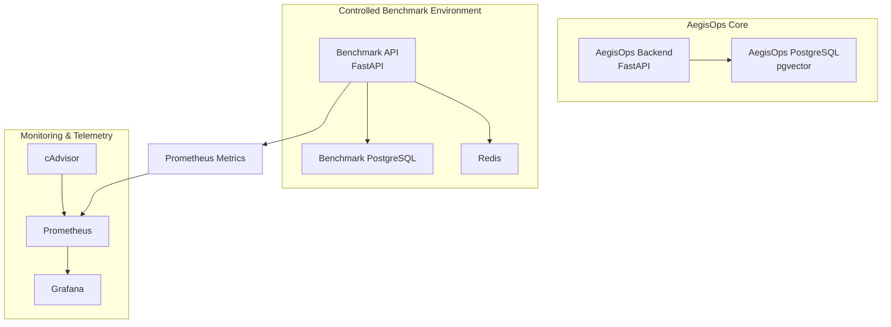

# AegisOps

AegisOps is a modular AI-powered incident operations platform being built to detect service failures, investigate evidence, identify root causes, request human approval for remediation, execute permitted recovery actions, verify recovery, and generate reusable postmortems.

The project is being developed incrementally so each architectural layer is understood before higher-level automation and AI reasoning are added.

> **Current status:** Phase 2 complete — Monitoring & Telemetry
> **Next phase:** Phase 3 — Incident Detection

---

## Current Architecture



The benchmark environment is deliberately separate from the AegisOps core. It exists so controlled failures can be generated without breaking AegisOps itself.

All local services are currently managed through the root `docker-compose.yml`.

---

## Completed Phases

| Phase | Status | Outcome |
|---|---|---|
| Phase 0 — Project Foundation | ✅ Complete | Git/GitHub, FastAPI, PostgreSQL, pgvector, Docker, Compose, config, DB connectivity |
| Phase 1 — Benchmark Environment | ✅ Complete | Breakable FastAPI target with dedicated PostgreSQL, Redis, real operations, and controlled failures |
| Phase 2 — Monitoring & Telemetry | ✅ Complete | Prometheus, cAdvisor, Grafana, HTTP metrics, latency, 5xx rate, dependency health, container telemetry |
| Phase 3 — Incident Detection | ⏳ Next | Rule-based incident creation, deduplication, severity, recovery-aware state handling |

Detailed phase documentation is available under:

```text
docs/phases/
```

---

## Phase 2 Monitoring Dashboard

The current Grafana dashboard visualizes:

- PostgreSQL and Redis availability
- HTTP request rate
- HTTP 5xx rate
- P95 request latency


The Phase 2 Docker stack includes the benchmark services, Prometheus, cAdvisor, Grafana, and the AegisOps PostgreSQL service.


---

## Repository Structure

```text
AegisOps/
│
├── backend/
│   ├── app/
│   │   ├── core/
│   │   ├── db/
│   │   └── main.py
│   ├── tests/
│   ├── requirements.txt
│   └── requirements-dev.txt
│
├── benchmark/
│   ├── app/
│   │   └── main.py
│   ├── Dockerfile
│   └── requirements.txt
│
├── monitoring/
│   ├── prometheus.yml
│   └── grafana/
│       └── provisioning/
│           └── datasources/
│               └── prometheus.yml
│
├── docs/
│   ├── phases/
│   │   ├── phase-00-project-foundation.md
│   │   ├── phase-01-benchmark-environment.md
│   │   └── phase-02-monitoring-telemetry.md
│   └── screenshots/
│       └── phase 2/
│           ├── grafana.png
│           └── stack-running.png
│
├── .env.example
├── .gitignore
├── docker-compose.yml
└── README.md
```

---

## Core Technologies

### Current

- Python 3.12
- FastAPI
- Uvicorn
- PostgreSQL 16
- pgvector
- Redis
- psycopg
- Docker
- Docker Compose
- Prometheus
- cAdvisor
- Grafana

### Planned Later

- Gemini
- LangGraph
- n8n
- SentenceTransformers
- RAG
- Slack
- Discord
- AWS
- Terraform

Technologies are introduced only when their phase actually needs them.

---

## AegisOps Backend

Current core API endpoints:

```text
GET /health
GET /ready
```

`/health` answers whether the API process is alive.

`/ready` answers whether the backend is operational with its required PostgreSQL dependency.

---

## Benchmark API

The benchmark environment currently exposes:

```text
GET  /health
GET  /ready
POST /items
GET  /items
GET  /activity
GET  /simulate/error
GET  /simulate/slow
GET  /metrics
```

The benchmark is intentionally simple but realistic enough to produce useful incident evidence.

### Controlled failures

The benchmark can currently simulate:

- PostgreSQL outage
- Redis outage
- HTTP 500 errors
- artificial API latency

Example:

```powershell
docker compose stop benchmark-db
docker compose start benchmark-db
```

```powershell
docker compose stop benchmark-redis
docker compose start benchmark-redis
```

---

## Monitoring Metrics

Custom benchmark metrics currently include:

```text
benchmark_http_requests_total
benchmark_http_request_duration_seconds
benchmark_dependency_up
```

The monitoring stack also collects container-level metrics through cAdvisor.

Prometheus scrapes:

```text
benchmark-api:8000/metrics
cadvisor:8080/metrics
```

Grafana uses Prometheus as its default datasource.

---

## Local Services

Typical local endpoints:

```text
AegisOps backend      http://127.0.0.1:8000
Benchmark API         http://127.0.0.1:8001
cAdvisor              http://127.0.0.1:8080
Prometheus             http://127.0.0.1:9090
Grafana                http://127.0.0.1:3000
```

PostgreSQL host ports are configurable through `.env`.

The shared default remains:

```env
POSTGRES_PORT=5432
```

Developers can override this locally if the port is already occupied.

---

## Quick Start

Create a local environment file from the example configuration:

```powershell
Copy-Item .env.example .env
```

Update local credentials as needed.

Start the Docker environment:

```powershell
docker compose up -d --build
```

Check service status:

```powershell
docker compose ps
```

Run the AegisOps backend separately:

```powershell
cd backend
.\venv\Scripts\Activate.ps1
uvicorn app.main:app --reload
```

---

## Development Approach

AegisOps is intentionally being built phase by phase.

The project follows a few rules:

- introduce a technology only when a phase genuinely needs it
- keep the benchmark system separate from the AegisOps core
- avoid hardcoded diagnoses
- keep remediation human-approved
- gather objective evidence before reasoning about incidents
- prefer meaningful end-of-phase verification over excessive micro-testing
- document each completed phase with architecture, lessons, verification, and representative screenshots

---

## Documentation

Detailed implementation notes:

- [Phase 0 — Project Foundation](docs/phases/phase-00-project-foundation.md)
- [Phase 1 — Benchmark Environment](docs/phases/phase-01-benchmark-environment.md)
- [Phase 2 — Monitoring & Telemetry](docs/phases/phase-02-monitoring-telemetry.md)

---

## Current Milestone

AegisOps can now:

```text
run a controlled target system
        ↓
produce repeatable failures
        ↓
collect application telemetry
        ↓
collect dependency health
        ↓
collect container telemetry
        ↓
store time-series evidence in Prometheus
        ↓
visualize system behavior in Grafana
```

The next milestone is **Phase 3 — Incident Detection**, where telemetry will begin turning into explicit incident records instead of remaining passive monitoring data.
