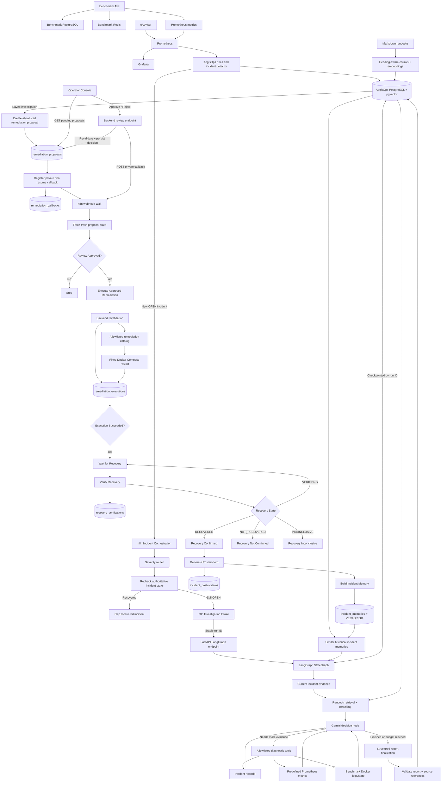

# AegisOps

AegisOps is a modular AI-powered incident operations platform built to detect service failures, investigate evidence, propose human-approved remediation, execute only allowlisted recovery actions, independently verify recovery, and turn resolved incidents into reusable operational memory.

The project is developed incrementally so each architectural layer is understood before higher-level orchestration and AI reasoning are added.

> **Current status:** Phase 14 complete — Postmortem & Incident Memory
> **Next phase:** Phase 15 — Operator Dashboard
> **Roadmap:** 15 of 21 phases complete (Phases 0–14)

---

## Current Architecture



The benchmark environment is deliberately separate from the AegisOps core. It produces controlled failures and telemetry; AegisOps consumes that telemetry and stores incident, investigation, proposal, approval, callback, execution, recovery, postmortem, and incident-memory state independently.

The remediation boundary remains strict:

```text
AI proposes.
Human approves.
Backend validates.
Backend executes only a predefined action.
Monitoring independently verifies recovery.
Postmortem generation happens only after confirmed recovery.
```

n8n orchestrates the workflow, but the backend remains authoritative for review state, execution authorization, recovery state, and persisted incident memory.

---

## Completed Phases

| Phase | Status | Outcome |
|---|---|---|
| Phase 0 — Project Foundation | ✅ Complete | Git/GitHub, FastAPI, PostgreSQL, pgvector, Docker, Compose, configuration, DB connectivity |
| Phase 1 — Benchmark Environment | ✅ Complete | Breakable FastAPI target with dedicated PostgreSQL, Redis, real operations, and controlled failures |
| Phase 2 — Monitoring & Telemetry | ✅ Complete | Prometheus, cAdvisor, Grafana, HTTP metrics, latency, 5xx rate, dependency health, container telemetry |
| Phase 3 — Incident Detection Engine | ✅ Complete | Deterministic Prometheus rules, incident persistence, deduplication, severity, automatic resolution |
| Phase 4 — Advanced Workflow Orchestration | ✅ Complete | Production webhook, severity routing, live incident recheck, retries, recovery skip, shared investigation intake |
| Phase 5 — LLM Investigation v1 | ✅ Complete | Gemini structured investigation, Prometheus evidence snapshot, PostgreSQL report history, n8n hand-off |
| Phase 6 — Embeddings & Knowledge Base | ✅ Complete | CPU-based 384-dimensional embeddings, pgvector schema, duplicate-safe document ingestion |
| Phase 7 — RAG Pipeline | ✅ Complete | Heading-aware chunks, pgvector retrieval, bounded context selection, validated runbook references |
| Phase 8 — Reranking & Context Engineering | ✅ Complete | Cross-encoder reranking, duplicate-free context, excerpt budget, persisted retrieval/rerank scores |
| Phase 9 — Tool Calling Layer | ✅ Complete | Read-only incident/metric/log tools, validated allowlists, bounded Gemini tool loop |
| Phase 10 — LangGraph Investigation Agent | ✅ Complete | Stateful investigation graph, PostgreSQL checkpointing, conditional tool loop, budget-aware persistence |
| Phase 11 — Human-in-the-Loop Remediation | ✅ Complete | Allowlisted proposals, auditable review decisions, authenticated human approval |
| Phase 12 — Automated Remediation | ✅ Complete | Backend-controlled execution, callback-driven approval, execution audit, idempotent retry protection |
| Phase 13 — Recovery Verification | ✅ Complete | Bounded monitoring-based recovery verification, two consecutive healthy checks, terminal recovery outcomes, incident resolution |
| Phase 14 — Postmortem & Incident Memory | ✅ Complete | Deterministic lifecycle reconstruction, grounded structured postmortems, 384-dim incident memories, pgvector similarity retrieval, historical context in future investigations |
| Phase 15 — Operator Dashboard | ⏳ Next | Replace the temporary embedded operator page with the final operator-facing dashboard while preserving backend authority |

Detailed phase documentation is available under:

```text
docs/phases/
```

---

## Phase 2 — Monitoring Foundation

Prometheus collects benchmark application metrics and cAdvisor container telemetry, while Grafana provides human-facing visualization.


```text
Prometheus = telemetry source
Grafana    = visualization
AegisOps   = incident detection and state
```

---

## Phase 3 — Incident Detection Engine

AegisOps converts deterministic Prometheus rule violations into durable PostgreSQL incidents.

Current rule families include:

```text
PostgreSQL unavailable
Redis unavailable
HTTP 5xx rate elevated
P95 latency elevated
```

A fingerprint based on `service + rule_key` prevents duplicate OPEN incidents. Persistent unhealthy telemetry updates the existing incident; recovered telemetry transitions it to `RESOLVED`.


---

## Phase 4 — Real Incident Orchestration

AegisOps notifies n8n once when a new incident is created. n8n routes by severity and rechecks authoritative incident state before investigation.

Recovered incidents take the skip path:


Active incidents proceed into the shared Investigation Intake workflow:


See [Phase 4 implementation and verification](docs/phases/phase-04-workflow-orchestration.md).

---

## Phase 5 — Evidence-Grounded LLM Investigation

AegisOps turns an OPEN incident into a structured preliminary investigation. The backend collects current evidence, asks Gemini for observations, hypotheses, missing evidence, and suggested checks, validates the response, and stores it in PostgreSQL.


Saved investigations can be retrieved without another Gemini call.

See [Phase 5 implementation and verification](docs/phases/phase-05-llm-investigation.md).

---

## Phase 6 — Embeddings & Knowledge Base

Phase 6 introduced a local knowledge store using SentenceTransformers and pgvector. Runbooks and sample documents are stored with normalized 384-dimensional embeddings and stable source keys.


See [Phase 6 implementation and verification](docs/phases/phase-06-embeddings-knowledge-base.md).

---

## Phase 7 — RAG Pipeline

Runbooks are split into heading-aware chunks and stored with local embeddings. Incident context is embedded and searched through pgvector before Gemini is called.


Returned `runbook_source_ids` are validated against the retrieved source IDs.


See [Phase 7 implementation and verification](docs/phases/phase-07-rag-pipeline.md).

---

## Phase 8 — Reranking & Context Engineering

A local cross-encoder reranks vector-search candidates so the final context is ordered by task relevance rather than vector similarity alone.


The context builder keeps a bounded, duplicate-free set of excerpts and stores both retrieval and rerank scores.


See [Phase 8 implementation and verification](docs/phases/phase-08-context-engineering.md).

---

## Phase 9 — Controlled Tool Calling

Gemini can request additional evidence only through a fixed read-only dispatcher.

Allowlisted tools cover:

```text
incident records
predefined Prometheus metrics
benchmark Docker logs/state
```

The tool loop is bounded by execution-round and total-call limits.


See [Phase 9 implementation and verification](docs/phases/phase-09-tool-calling-layer.md).

---

## Phase 10 — Checkpointed LangGraph Investigation Agent

Phase 10 replaced the manually managed tool loop with a checkpointed LangGraph StateGraph.

```text
collect evidence
→ retrieve/rerank runbooks
→ ask Gemini whether more evidence is needed
→ execute allowlisted tools
→ loop conditionally
→ finalize and persist a structured report
```


A fresh Redis incident was successfully routed through n8n into the LangGraph endpoint, and stable run IDs support checkpoint reuse.


See [Phase 10 implementation and verification](docs/phases/phase-10-langgraph-investigation-agent.md).

---

## Phase 11 — Human-in-the-Loop Remediation

Phase 11 created the authorization boundary between investigation and action.

The backend can create a `PENDING` remediation proposal only for an OPEN incident with a matching saved investigation and an allowlisted action/target pair.


The original implementation used a Basic Auth-protected n8n form. Approve and reject paths were verified, and the backend stored reviewer, timestamp, and review note.


Phase 12 subsequently moved the human-facing approval surface out of the n8n form while preserving backend-authoritative review state.

See [Phase 11 implementation and safety boundaries](docs/phases/phase-11-human-in-the-loop-remediation.md).

---

## Phase 12 — Automated Remediation

Phase 12 turns an approved proposal into a controlled infrastructure action.

### Backend-controlled execution

```text
POST /remediations/proposals/{proposal_id}/execute
```

requires `X-AegisOps-Execution-Key`.

For a new execution, FastAPI revalidates the proposal, authorization window, incident state, allowlisted action, and exact target before invoking the fixed remediation executor.

Gemini and n8n never provide arbitrary shell commands.

### Operator Console and private callback

The authenticated Operator Console lists pending proposals through the backend. Approve/Reject decisions are submitted back to FastAPI; browser JavaScript never receives private backend review or execution keys.

n8n registers its private runtime resume URL with AegisOps, then sleeps in a webhook-based Wait node. After the backend commits the human decision, it wakes n8n through the private callback.

The workflow then fetches authoritative proposal state and continues only when it is actually `APPROVED`.


### Audited remediation

The backend persists execution state in `remediation_executions`.

A repeated execution request returns the existing execution with:

```text
reused = true
```

instead of executing the recovery action again.

**Boundary:** Phase 12 proves that the approved command executed successfully. Phase 13 independently verifies whether the monitored incident condition actually recovered.

See [Phase 12 implementation, callback architecture and verification](docs/phases/phase-12-automated-remediation.md).

---

## Phase 13 — Recovery Verification

Phase 13 separates **command success** from **service recovery**.

A `SUCCEEDED` remediation execution does not automatically mean the original incident condition recovered. After execution, n8n waits and asks the backend to re-evaluate the original incident rule against Prometheus.

### Stateful recovery lifecycle

Recovery verification is stored in `recovery_verifications`, with one verification lifecycle per remediation execution.

Supported states:

```text
VERIFYING
RECOVERED
NOT_RECOVERED
INCONCLUSIVE
```

The current policy is:

```text
maximum attempts          = 3
required healthy checks   = 2 consecutive checks
n8n wait between checks   = 15 seconds
```

The backend reuses the existing incident rule definitions and Prometheus evaluation path rather than introducing separate recovery-specific thresholds.

The verification endpoint is protected by the existing execution credential:

```text
POST /remediations/executions/{execution_id}/verify
X-AegisOps-Execution-Key: ...
```

### Recovery behavior

- healthy telemetry increments the consecutive-healthy counter
- unhealthy telemetry resets the counter
- two consecutive healthy checks produce `RECOVERED`
- three failed healthy attempts produce `NOT_RECOVERED`
- repeated unavailable telemetry can produce `INCONCLUSIVE`
- terminal verification responses are idempotently reusable
- `RECOVERED` ensures the incident is resolved through the existing incident repository

The detector may resolve an incident as soon as the metric becomes healthy, while Phase 13 still performs its own two-check confirmation. These are intentionally separate responsibilities.


The verified success path is:

```text
Execution Succeeded
→ Wait for Recovery
→ Verify Recovery
→ VERIFYING
→ Wait for Recovery
→ Verify Recovery
→ RECOVERED
→ Recovery Confirmed
```

See [Phase 13 implementation and verification](docs/phases/phase-13-recovery-verification.md).

---

## Phase 14 — Postmortem & Incident Memory

Phase 14 adds the learning layer after verified recovery.

The central rule is:

```text
deterministic facts != LLM interpretation
```

### Deterministic timeline

AegisOps reconstructs the incident lifecycle directly from PostgreSQL, including incident creation, investigation, remediation proposal, human review, execution, recovery verification, and resolution.

Gemini does not create these lifecycle events.

### Grounded postmortem generation

Gemini receives the deterministic timeline and saved evidence and returns a structured postmortem.

The prompt explicitly distinguishes:

```text
observed failure mechanism
from
initiating root cause
```

For the PostgreSQL test case, logs proved that the container received a fast shutdown request, but did not prove which user, process, or automation initiated it. The final report therefore recorded:

```text
probable_root_cause = Undetermined from available evidence.
root_cause_confidence = LOW
```

This prevents the postmortem from converting temporal evidence into unsupported causal certainty.

### Canonical persistence and idempotency

Canonical postmortems are stored in:

```text
incident_postmortems
```

Incident memory is stored in:

```text
incident_memories
```

The generation service is idempotent. If an incident already has both records, a repeated request returns the existing identifiers with:

```text
reused = true
```

instead of making another Gemini call.

### Historical incident memory

Postmortem content is reduced into reusable operational memory and embedded with:

```text
sentence-transformers/all-MiniLM-L6-v2
dimensions = 384
```

The embedding is stored with pgvector.

A PostgreSQL-oriented similarity query ranked a historical PostgreSQL incident above Redis:

```text
PostgreSQL incident 22 = 0.6522
Redis incident 20      = 0.4305
```

When invoked through the investigation retrieval layer, the same relationship remained clear:

```text
PostgreSQL incident 22 = 0.7751
Redis incident 20      = 0.5260
```

Historical memories are supplied to future LangGraph investigations alongside runbook context, but Gemini is explicitly instructed that semantic similarity is **reference material, not proof of the current root cause**.

### n8n integration

After Phase 13 confirms recovery, the workflow continues:

```text
Recovery Confirmed
→ Generate Postmortem
→ Postmortem Created?
→ Postmortem Generation Successful
```

A postmortem failure does not change the already-confirmed remediation/recovery result.


Final end-to-end verification used a fresh PostgreSQL outage. Incident `27` completed with:

```text
incident_status  = RESOLVED
execution_status = SUCCEEDED
recovery_status  = RECOVERED
postmortem_id    = 5
memory_id        = 4
dimensions       = 384
```


See [Phase 14 implementation and verification](docs/phases/phase-14-postmortem-incident-memory.md).

---

## Repository Structure

```text
AegisOps/
│
├── backend/
│   ├── app/
│   │   ├── core/
│   │   ├── db/
│   │   ├── incidents/
│   │   ├── investigations/
│   │   ├── knowledge/
│   │   ├── monitoring/
│   │   ├── orchestration/
│   │   ├── operator_routes.py
│   │   ├── remediation.py
│   │   ├── remediation_routes.py
│   │   ├── recovery.py
│   │   ├── postmortem.py
│   │   ├── postmortem_gemini.py
│   │   ├── postmortem_routes.py
│   │   ├── postmortem_schemas.py
│   │   ├── postmortem_service.py
│   │   └── main.py
│   ├── sql/
│   │   ├── 001_create_incidents.sql
│   │   ├── 002_create_investigations.sql
│   │   ├── 003_create_knowledge_documents.sql
│   │   ├── 004_create_knowledge_chunks.sql
│   │   ├── 005_create_remediation_proposals.sql
│   │   ├── 006_create_remediation_executions.sql
│   │   ├── 007_create_remediation_callbacks.sql
│   │   ├── 008_create_recovery_verifications.sql
│   │   ├── 009_create_incident_postmortems.sql
│   │   └── 010_create_incident_memories.sql
│   ├── scripts/
│   ├── tests/
│   ├── requirements.txt
│   └── requirements-dev.txt
│
├── benchmark/
├── monitoring/
├── docs/
│   ├── phases/
│   │   ├── phase-00-project-foundation.md
│   │   ├── ...
│   │   ├── phase-12-automated-remediation.md
│   │   ├── phase-13-recovery-verification.md
│   │   └── phase-14-postmortem-incident-memory.md
│   ├── runbooks/
│   └── screenshots/
│       ├── phase 13/
│       │   ├── n8n_final.png
│       │   └── recovery proof.png
│       └── phase 14/
│           ├── phase 14 n8n.png
│           └── postmortem_db_verification.png
│
├── workflows/
│   ├── AegisOps Incident Orchestration.json
│   └── AegisOps Investigation Intake.json
├── .env.example
├── .gitignore
├── docker-compose.yml
└── README.md
```

---

## Core Technologies

### Current

- Python 3.12
- FastAPI
- Uvicorn
- PostgreSQL 16
- pgvector
- Redis
- psycopg
- httpx
- Docker
- Docker Compose
- Prometheus
- cAdvisor
- Grafana
- n8n
- Gemini via `google-genai`
- Pydantic structured-output validation
- LangGraph StateGraph
- PostgreSQL LangGraph checkpointing
- SentenceTransformers
- local cross-encoder reranking
- pgvector Python adapter

### Planned Later

- production-facing operator dashboard
- Slack / Discord notifications where useful
- AWS
- Terraform

Technologies are introduced only when their phase has a real architectural need.

---

## AegisOps Backend

Current core endpoints include:

```text
GET  /health
GET  /ready

GET  /incidents
POST /incidents/detect
GET  /incidents/{incident_id}

POST /investigations/{incident_id}/run
POST /investigations/{incident_id}/run-agent?run_id={uuid}
GET  /investigations/{investigation_id}
GET  /investigations/by-incident/{incident_id}

POST /remediations/proposals
GET  /remediations/proposals
GET  /remediations/proposals/{proposal_id}
POST /remediations/from-investigation/{investigation_id}
POST /remediations/proposals/{proposal_id}/callback
POST /remediations/proposals/{proposal_id}/review
POST /remediations/proposals/{proposal_id}/execute
POST /remediations/executions/{execution_id}/verify

GET  /operator
POST /operator/proposals/{proposal_id}/review

POST /postmortems/incidents/{incident_id}/generate
GET  /postmortems/incidents/{incident_id}
GET  /postmortems/incidents/{incident_id}/memory
GET  /postmortems/search
```

`/health` confirms that FastAPI is alive.

`/ready` verifies connectivity to AegisOps PostgreSQL.

The LangGraph endpoint uses a stable `run_id` for checkpoint reuse and prevents unnecessary duplicate investigation work.

The remediation APIs keep proposal creation, human review, orchestration callback registration, execution, and recovery verification as separate trust boundaries.

The postmortem APIs expose canonical postmortem generation/retrieval, reusable memory retrieval, and semantic search over historical incidents.

The current `/operator` route is a temporary UI/API adapter. Phase 15 can replace the embedded frontend without moving authoritative review or execution logic into the browser.

---

## Incident Detection Rules

| Rule | Threshold | Severity |
|---|---:|---|
| PostgreSQL unavailable | dependency value `== 0` | HIGH |
| Redis unavailable | dependency value `== 0` | HIGH |
| HTTP 5xx rate high | `> 0.05 req/s` | MEDIUM |
| API P95 latency high | `> 2.0 s` | MEDIUM |

Rules define measurable unhealthy conditions. They do not hardcode root-cause conclusions.

---

## Incident State & Deduplication

Current incident lifecycle:

```text
OPEN
RESOLVED
```

An active incident fingerprint is based on:

```text
service + rule_key
```

While a condition remains unhealthy, future detection cycles update the existing OPEN incident instead of creating duplicates.

Recovery verification has its own state machine:

```text
VERIFYING
RECOVERED
NOT_RECOVERED
INCONCLUSIVE
```

This keeps incident state and verification evidence related but distinct.

---

## Benchmark API

The benchmark environment exposes controlled targets such as:

```text
GET  /health
GET  /ready
POST /items
GET  /items
GET  /activity
GET  /simulate/error
GET  /simulate/slow
GET  /metrics
```

The benchmark can simulate:

- PostgreSQL outage
- Redis outage
- HTTP 500 errors
- artificial API latency

This provides known failure conditions without coupling AegisOps to a production application.

---

## Monitoring Metrics

Custom benchmark metrics include:

```text
benchmark_http_requests_total
benchmark_http_request_duration_seconds
benchmark_dependency_up
```

Prometheus also receives container telemetry through cAdvisor.

AegisOps queries Prometheus directly for incident detection, investigation evidence, and recovery verification.

---

## Knowledge Base, RAG & Incident Memory

Runbooks and embeddings are stored locally in AegisOps PostgreSQL.

`knowledge_documents` stores complete documents, while `knowledge_chunks` stores embedded sections linked to their source documents.

Runbook retrieval uses:

```text
incident context
→ vector retrieval
→ cross-encoder reranking
→ bounded context selection
```

Phase 14 adds a second retrieval channel:

```text
resolved incident
→ structured postmortem
→ compact incident memory
→ 384-dimensional embedding
→ pgvector similarity search
→ historical context for future investigations
```

Future investigations therefore receive both:

```text
runbook knowledge
+
similar historical incidents
```

Historical incidents remain supporting context only. They are never treated as proof that a new incident has the same initiating cause.

---

## Configuration

Important local configuration includes:

```env
POSTGRES_PORT=5432
PROMETHEUS_URL=http://127.0.0.1:9090
INCIDENT_DETECTION_INTERVAL_SECONDS=10
N8N_INCIDENT_WEBHOOK_URL=http://127.0.0.1:5678/webhook/aegisops-incident

GEMINI_API_KEY=
GEMINI_MODEL=gemini-3.5-flash-lite

REMEDIATION_REVIEW_KEY=
REMEDIATION_EXECUTION_KEY=

OPERATOR_CONSOLE_USERNAME=
OPERATOR_CONSOLE_PASSWORD=
```

Keep actual credentials only in the untracked `.env` file.

n8n header credentials should remain inside n8n credential storage rather than exported workflow JSON.

Never commit:

- Gemini API keys
- remediation review/execution keys
- Operator Console passwords
- signed n8n resume URLs
- production secrets
- raw sensitive logs

---

## Local Services

Typical development endpoints:

```text
AegisOps backend      http://127.0.0.1:8000
Operator Console      http://127.0.0.1:8000/operator
Benchmark API         http://127.0.0.1:8001
cAdvisor              http://127.0.0.1:8080
Prometheus            http://127.0.0.1:9090
Grafana               http://127.0.0.1:3000
n8n                    http://127.0.0.1:5678
```

---

## Quick Start

Create a local environment file:

```powershell
Copy-Item .env.example .env
```

Start Docker services:

```powershell
docker compose up -d --build
```

Check the stack:

```powershell
docker compose ps
```

Apply database migrations through:

```text
010_create_incident_memories.sql
```

Start FastAPI:

```powershell
cd backend
.\venv\Scripts\Activate.ps1
pip install -r requirements.txt
uvicorn app.main:app --reload
```

Start the local n8n installation separately and publish:

```text
AegisOps Incident Orchestration
AegisOps Investigation Intake
```

Configure private n8n Header Auth credentials for the remediation execution capability. Do not place secret values directly inside exported workflow JSON.

---

## Development Approach

AegisOps is intentionally built phase by phase.

Project rules include:

- introduce a technology only when a phase genuinely needs it
- keep the benchmark environment separate from the AegisOps core
- avoid hardcoded diagnoses
- prefer deterministic logic when deterministic logic is the better tool
- gather objective evidence before model reasoning
- distinguish observed mechanisms from unproven initiating root causes
- keep infrastructure mutation human-approved
- keep execution actions allowlisted
- preserve backend authority across workflow/UI boundaries
- keep command execution success separate from recovery verification
- prefer meaningful end-of-phase verification over excessive micro-testing
- avoid repeated Gemini calls when saved/checkpointed results can support downstream work
- document each completed phase with architecture, verification evidence, and representative screenshots

---

## Documentation

- [Phase 0 — Project Foundation](docs/phases/phase-00-project-foundation.md)
- [Phase 1 — Benchmark Environment](docs/phases/phase-01-benchmark-environment.md)
- [Phase 2 — Monitoring & Telemetry](docs/phases/phase-02-monitoring-telemetry.md)
- [Phase 3 — Incident Detection Engine](docs/phases/phase-03-incident-detection-engine.md)
- [Phase 4 — Advanced Workflow Orchestration](docs/phases/phase-04-workflow-orchestration.md)
- [Phase 5 — LLM Investigation v1](docs/phases/phase-05-llm-investigation.md)
- [Phase 6 — Embeddings & Knowledge Base](docs/phases/phase-06-embeddings-knowledge-base.md)
- [Phase 7 — RAG Pipeline](docs/phases/phase-07-rag-pipeline.md)
- [Phase 8 — Reranking & Context Engineering](docs/phases/phase-08-context-engineering.md)
- [Phase 9 — Tool Calling Layer](docs/phases/phase-09-tool-calling-layer.md)
- [Phase 10 — LangGraph Investigation Agent](docs/phases/phase-10-langgraph-investigation-agent.md)
- [Phase 11 — Human-in-the-Loop Remediation](docs/phases/phase-11-human-in-the-loop-remediation.md)
- [Phase 12 — Automated Remediation](docs/phases/phase-12-automated-remediation.md)
- [Phase 13 — Recovery Verification](docs/phases/phase-13-recovery-verification.md)
- [Phase 14 — Postmortem & Incident Memory](docs/phases/phase-14-postmortem-incident-memory.md)

---

## Current Milestone

The current verified architecture is:

```text
Controlled benchmark outage
        ↓
Prometheus + deterministic incident detection
        ↓
Durable OPEN incident
        ↓
n8n severity routing + live incident recheck
        ↓
Checkpointed LangGraph investigation
        ↓
Runbook RAG + reranking + historical incident memory
        ↓
Bounded read-only diagnostic tools
        ↓
Structured investigation saved in PostgreSQL
        ↓
Backend-created allowlisted remediation proposal
        ↓
Private n8n callback registration
        ↓
Human decision in authenticated Operator Console
        ↓
Backend persists APPROVED / REJECTED
        ↓
APPROVED only
        ↓
Protected remediation execution
        ↓
Backend revalidates action, target, incident and authorization
        ↓
Fixed Docker Compose recovery action
        ↓
Persistent execution audit
        ↓
Bounded Prometheus recovery verification
        ↓
Two consecutive healthy checks
        ↓
RECOVERED
        ↓
Deterministic incident lifecycle reconstruction
        ↓
Grounded Gemini postmortem
        ↓
Canonical postmortem persistence
        ↓
384-dimensional incident-memory embedding
        ↓
Historical memory available to future investigations
```

### Phase 13 verification

Phase 13 successfully demonstrated that AegisOps does not equate a successful Docker command with incident recovery.

The verified workflow performed two consecutive healthy checks against the original monitoring rule before producing:

```text
recovery_status      = RECOVERED
attempt_count        = 2
consecutive_healthy  = 2
```

The final n8n workflow and database evidence are stored under:

```text
docs/screenshots/phase 13/
```

### Phase 14 verification

A fresh PostgreSQL outage completed the entire workflow through historical-memory creation.

Final verified state:

```text
incident_id      = 27
incident_status  = RESOLVED
execution_status = SUCCEEDED
recovery_status  = RECOVERED
postmortem_id    = 5
memory_id        = 4
dimensions       = 384
```

The full successful n8n path and database proof are stored under:

```text
docs/screenshots/phase 14/
```

Phase 14 therefore proves that AegisOps can not only recover and verify an incident, but also convert the resolved event into reusable evidence-grounded operational memory.

**Next: Phase 15 — Operator Dashboard.**
