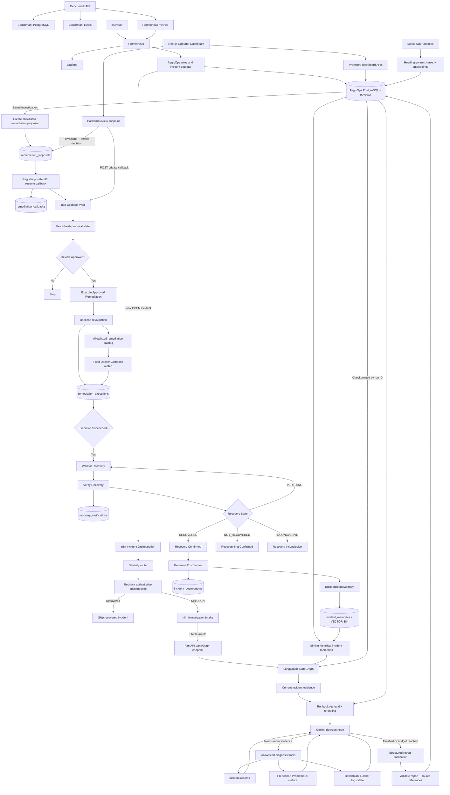

# AegisOps

AegisOps is a modular AI-powered incident operations platform built to detect service failures, investigate evidence, propose human-approved remediation, execute only allowlisted recovery actions, independently verify recovery, and convert resolved incidents into reusable operational memory.

The project is developed incrementally so each architectural layer is understood before higher-level orchestration and AI reasoning are added.

> **Current status:** Phase 15 complete — Operator Dashboard
> **Next phase:** Phase 16 — Evals & Observability
> **Roadmap:** 16 of 21 phases complete (Phases 0–15)

---

## Current Architecture



The benchmark environment is deliberately separate from the AegisOps core. It produces controlled failures and telemetry; AegisOps consumes that telemetry and persists incident, investigation, proposal, approval, execution, recovery, postmortem, and incident-memory state independently.

The remediation boundary remains strict:

```text
AI proposes.
Human approves.
Backend validates.
Backend executes only a predefined action.
Monitoring independently verifies recovery.
Postmortem generation happens only after confirmed recovery.
```

The Next.js dashboard is an operator-facing control surface, not a source of authority. n8n still orchestrates workflow progression, while FastAPI and PostgreSQL remain authoritative for review state, execution authorization, recovery state, and persisted operational memory.

---

## Completed Phases

| Phase | Status | Outcome |
|---|---|---|
| Phase 0 — Project Foundation | ✅ Complete | Git/GitHub, FastAPI, PostgreSQL, pgvector, Docker, Compose, configuration, DB connectivity |
| Phase 1 — Benchmark Environment | ✅ Complete | Breakable FastAPI target with dedicated PostgreSQL, Redis, real operations, and controlled failures |
| Phase 2 — Monitoring & Telemetry | ✅ Complete | Prometheus, cAdvisor, Grafana, HTTP metrics, latency, 5xx rate, dependency health, container telemetry |
| Phase 3 — Incident Detection Engine | ✅ Complete | Deterministic Prometheus rules, incident persistence, deduplication, severity, automatic resolution |
| Phase 4 — Advanced Workflow Orchestration | ✅ Complete | Production webhook, severity routing, live incident recheck, retries, recovery skip, shared investigation intake |
| Phase 5 — LLM Investigation v1 | ✅ Complete | Gemini structured investigation, Prometheus evidence snapshot, PostgreSQL report history, n8n hand-off |
| Phase 6 — Embeddings & Knowledge Base | ✅ Complete | CPU-based 384-dimensional embeddings, pgvector schema, duplicate-safe document ingestion |
| Phase 7 — RAG Pipeline | ✅ Complete | Heading-aware chunks, pgvector retrieval, bounded context selection, validated runbook references |
| Phase 8 — Reranking & Context Engineering | ✅ Complete | Cross-encoder reranking, duplicate-free context, excerpt budget, persisted retrieval/rerank scores |
| Phase 9 — Tool Calling Layer | ✅ Complete | Read-only incident/metric/log tools, validated allowlists, bounded Gemini tool loop |
| Phase 10 — LangGraph Investigation Agent | ✅ Complete | Stateful investigation graph, PostgreSQL checkpointing, conditional tool loop, budget-aware persistence |
| Phase 11 — Human-in-the-Loop Remediation | ✅ Complete | Allowlisted proposals, auditable review decisions, authenticated human approval |
| Phase 12 — Automated Remediation | ✅ Complete | Backend-controlled execution, callback-driven approval, execution audit, idempotent retry protection |
| Phase 13 — Recovery Verification | ✅ Complete | Bounded monitoring-based recovery verification, two consecutive healthy checks, terminal recovery outcomes, incident resolution |
| Phase 14 — Postmortem & Incident Memory | ✅ Complete | Deterministic lifecycle reconstruction, grounded structured postmortems, 384-dim incident memories, pgvector similarity retrieval |
| Phase 15 — Operator Dashboard | ✅ Complete | Next.js operations dashboard, live health overview, incident history/detail, investigations, human remediation approval, recovery visibility, postmortem views |

Detailed phase documentation is available under:

```text
docs/phases/
```

---

## Phase 2 — Monitoring Foundation

Prometheus collects benchmark application metrics and cAdvisor container telemetry, while Grafana provides human-facing visualization.


```text
Prometheus = telemetry source
Grafana    = visualization
AegisOps   = incident detection and state
```

---

## Phase 3 — Incident Detection Engine

AegisOps converts deterministic Prometheus rule violations into durable PostgreSQL incidents.

Current rule families include:

```text
PostgreSQL unavailable
Redis unavailable
HTTP 5xx rate elevated
P95 latency elevated
```

A fingerprint based on `service + rule_key` prevents duplicate OPEN incidents. Persistent unhealthy telemetry updates the existing incident; recovered telemetry transitions it to `RESOLVED`.


---

## Phase 4 — Real Incident Orchestration

AegisOps notifies n8n once when a new incident is created. n8n routes by severity and rechecks authoritative incident state before investigation.

Recovered incidents take the skip path:


Active incidents proceed into the shared Investigation Intake workflow:


See [Phase 4 implementation and verification](docs/phases/phase-04-workflow-orchestration.md).

---

## Phase 5 — Evidence-Grounded LLM Investigation

AegisOps turns an OPEN incident into a structured preliminary investigation. The backend collects current evidence, asks Gemini for observations, hypotheses, missing evidence, and suggested checks, validates the response, and stores it in PostgreSQL.


Saved investigations can be retrieved without another Gemini call.

See [Phase 5 implementation and verification](docs/phases/phase-05-llm-investigation.md).

---

## Phase 6 — Embeddings & Knowledge Base

Phase 6 introduced a local knowledge store using SentenceTransformers and pgvector. Runbooks and sample documents are stored with normalized 384-dimensional embeddings and stable source keys.


See [Phase 6 implementation and verification](docs/phases/phase-06-embeddings-knowledge-base.md).

---

## Phase 7 — RAG Pipeline

Runbooks are split into heading-aware chunks and stored with local embeddings. Incident context is embedded and searched through pgvector before Gemini is called.


Returned `runbook_source_ids` are validated against the retrieved source IDs.


See [Phase 7 implementation and verification](docs/phases/phase-07-rag-pipeline.md).

---

## Phase 8 — Reranking & Context Engineering

A local cross-encoder reranks vector-search candidates so the final context is ordered by task relevance rather than vector similarity alone.


The context builder keeps a bounded, duplicate-free set of excerpts and stores both retrieval and rerank scores.


See [Phase 8 implementation and verification](docs/phases/phase-08-reranking-context-engineering.md).

---

## Phase 9 — Controlled Tool Calling

Gemini can request additional evidence only through a fixed read-only dispatcher.

Allowlisted tools cover:

```text
incident records
predefined Prometheus metrics
benchmark Docker logs/state
```

The tool loop is bounded by execution-round and total-call limits.


See [Phase 9 implementation and verification](docs/phases/phase-09-tool-calling-layer.md).

---

## Phase 10 — Checkpointed LangGraph Investigation Agent

Phase 10 replaced the manually managed tool loop with a checkpointed LangGraph StateGraph.

```text
collect evidence
→ retrieve/rerank runbooks
→ ask Gemini whether more evidence is needed
→ execute allowlisted tools
→ loop conditionally
→ finalize and persist a structured report
```


See [Phase 10 implementation and verification](docs/phases/phase-10-langgraph-investigation-agent.md).

---

## Phase 11 — Human-in-the-Loop Remediation

Phase 11 created the authorization boundary between investigation and action.

The backend can create a `PENDING` remediation proposal only for an OPEN incident with a matching saved investigation and an allowlisted action/target pair.


Phase 12 subsequently moved approval orchestration away from the original n8n form while preserving backend-authoritative review state.

See [Phase 11 implementation and safety boundaries](docs/phases/phase-11-human-in-the-loop-remediation.md).

---

## Phase 12 — Automated Remediation

Phase 12 turns an approved proposal into a controlled infrastructure action.

For every new execution, FastAPI revalidates:

```text
proposal status
authorization window
incident state
allowlisted action
exact target service
```

Gemini and n8n never provide arbitrary shell commands.

The backend persists execution state in `remediation_executions`, and duplicate execution requests reuse the existing result instead of repeating the infrastructure action.


See [Phase 12 implementation, callback architecture and verification](docs/phases/phase-12-automated-remediation.md).

---

## Phase 13 — Recovery Verification

Phase 13 separates **command success** from **service recovery**.

A `SUCCEEDED` remediation execution does not automatically mean the original incident condition recovered. AegisOps independently re-evaluates the original monitoring rule through Prometheus.

Supported recovery states:

```text
VERIFYING
RECOVERED
NOT_RECOVERED
INCONCLUSIVE
```

Current policy:

```text
maximum attempts          = 3
required healthy checks   = 2 consecutive checks
n8n wait between checks   = 15 seconds
```


See [Phase 13 implementation and verification](docs/phases/phase-13-recovery-verification.md).

---

## Phase 14 — Postmortem & Incident Memory

Phase 14 adds the learning layer after verified recovery.

The central rule is:

```text
deterministic facts != LLM interpretation
```

AegisOps reconstructs the incident lifecycle from PostgreSQL and only then asks Gemini to generate a structured postmortem.

Canonical postmortems are stored in:

```text
incident_postmortems
```

Compact reusable operational memory is stored in:

```text
incident_memories
```

Incident memory uses:

```text
sentence-transformers/all-MiniLM-L6-v2
dimensions = 384
```

Historical similarity is treated as reference material rather than proof of the current root cause.


See [Phase 14 implementation and verification](docs/phases/phase-14-postmortem-incident-memory.md).

---

## Phase 15 — Operator Dashboard

Phase 15 replaced the temporary embedded operator surface with a dedicated Next.js control plane for operators.

The dashboard exposes the existing backend workflow without moving authority into the browser.

### Operator surfaces

```text
/
├── live operations overview
├── service health
├── incident activity
├── response pipeline
└── recent incidents

/incidents
├── incident history
└── /incidents/{id} deterministic lifecycle timeline

/investigations
└── saved LangGraph investigation reports

/remediation
└── pending and historical human-review decisions

/postmortems
└── generated postmortems and incident-memory summaries
```

### Server-side trust boundary

Dashboard credentials remain server-side.

```text
Browser
  ↓
Next.js server component / server action
  ↓
authenticated FastAPI endpoint
  ↓
backend validation + PostgreSQL
```

The browser does not receive:

- operator backend credentials
- remediation review secrets
- remediation execution secrets
- signed n8n callback URLs

Human review remains a backend-authoritative action.

### Dashboard verification

The final interface was tested against real persisted AegisOps data and controlled benchmark dependency failures.

The service-health panel reflects direct service/container state, while incident counts reflect formally detected incident records. These may briefly differ because dependency monitoring, Prometheus scraping, and the incident worker operate on independent cadences.


See [Phase 15 implementation and verification](docs/phases/phase-15-operator-dashboard.md).

---

## Repository Structure

```text
AegisOps/
│
├── backend/
│   ├── app/
│   │   ├── core/
│   │   ├── db/
│   │   ├── incidents/
│   │   ├── investigations/
│   │   ├── knowledge/
│   │   ├── monitoring/
│   │   ├── orchestration/
│   │   ├── dashboard_routes.py
│   │   ├── operator_routes.py
│   │   ├── remediation.py
│   │   ├── remediation_routes.py
│   │   ├── recovery.py
│   │   ├── postmortem.py
│   │   ├── postmortem_gemini.py
│   │   ├── postmortem_routes.py
│   │   ├── postmortem_schemas.py
│   │   ├── postmortem_service.py
│   │   └── main.py
│   ├── sql/
│   ├── scripts/
│   ├── tests/
│   └── requirements.txt
│
├── benchmark/
│
├── dashboard/
│   ├── app/
│   │   ├── incidents/
│   │   ├── investigations/
│   │   ├── remediation/
│   │   ├── postmortems/
│   │   ├── globals.css
│   │   ├── layout.tsx
│   │   └── page.tsx
│   ├── components/
│   ├── lib/
│   │   └── aegisops.ts
│   ├── public/
│   ├── package.json
│   └── next.config.ts
│
├── monitoring/
│
├── docs/
│   ├── phases/
│   │   ├── phase-00-project-foundation.md
│   │   ├── ...
│   │   ├── phase-14-postmortem-incident-memory.md
│   │   └── phase-15-operator-dashboard.md
│   ├── runbooks/
│   └── screenshots/
│       ├── phase 14/
│       └── phase 15/
│
├── workflows/
├── .env.example
├── .gitignore
├── docker-compose.yml
└── README.md
```

---

## Core Technologies

### Current

- Python 3.12
- FastAPI
- Uvicorn
- PostgreSQL 16
- pgvector
- Redis
- psycopg
- httpx
- Docker
- Docker Compose
- Prometheus
- cAdvisor
- Grafana
- n8n
- Gemini via `google-genai`
- Pydantic structured-output validation
- LangGraph StateGraph
- PostgreSQL LangGraph checkpointing
- SentenceTransformers
- local cross-encoder reranking
- Next.js 16
- React 19
- TypeScript
- Tailwind CSS
- Lucide icons
- React Icons

### Remaining Roadmap

- Phase 16 — Evals & Observability
- Phase 17 — Connector Architecture
- Phase 18 — AWS Integration & Real Test Case
- Phase 19 — Velora Integration & Real Test Case
- Phase 20 — Hardening & Portfolio Packaging

Technologies are introduced only when their phase has a real architectural need.

---

## AegisOps Backend

Current core endpoint families include:

```text
GET  /health
GET  /ready

GET  /incidents
POST /incidents/detect
GET  /incidents/{incident_id}

POST /investigations/{incident_id}/run
POST /investigations/{incident_id}/run-agent?run_id={uuid}
GET  /investigations/{investigation_id}
GET  /investigations/by-incident/{incident_id}

POST /remediations/proposals
GET  /remediations/proposals
GET  /remediations/proposals/{proposal_id}
POST /remediations/from-investigation/{investigation_id}
POST /remediations/proposals/{proposal_id}/callback
POST /remediations/proposals/{proposal_id}/review
POST /remediations/proposals/{proposal_id}/execute
POST /remediations/executions/{execution_id}/verify

POST /operator/proposals/{proposal_id}/review

POST /postmortems/incidents/{incident_id}/generate
GET  /postmortems/incidents/{incident_id}
GET  /postmortems/incidents/{incident_id}/memory
GET  /postmortems/search

GET  /dashboard/api/overview
GET  /dashboard/api/incidents
GET  /dashboard/api/incidents/{incident_id}/detail
GET  /dashboard/api/investigations
GET  /dashboard/api/remediations
GET  /dashboard/api/postmortems
```

`/health` confirms that FastAPI is alive.

`/ready` verifies connectivity to AegisOps PostgreSQL.

The dashboard API exposes operator-safe aggregated views while keeping sensitive credentials and remediation execution capabilities server-side.

---

## Incident Detection Rules

| Rule | Threshold | Severity |
|---|---:|---|
| PostgreSQL unavailable | dependency value `== 0` | HIGH |
| Redis unavailable | dependency value `== 0` | HIGH |
| HTTP 5xx rate high | `> 0.05 req/s` | MEDIUM |
| API P95 latency high | `> 2.0 s` | MEDIUM |

Rules define measurable unhealthy conditions. They do not hardcode root-cause conclusions.

---

## Incident State & Deduplication

Current incident lifecycle:

```text
OPEN
RESOLVED
```

An active incident fingerprint is based on:

```text
service + rule_key
```

While a condition remains unhealthy, future detection cycles update the existing OPEN incident instead of creating duplicates.

Recovery verification has its own state machine:

```text
VERIFYING
RECOVERED
NOT_RECOVERED
INCONCLUSIVE
```

This keeps incident state and verification evidence related but distinct.

---

## Benchmark API

The benchmark environment exposes controlled targets such as:

```text
GET  /health
GET  /ready
POST /items
GET  /items
GET  /activity
GET  /simulate/error
GET  /simulate/slow
GET  /metrics
```

The benchmark can simulate:

- PostgreSQL outage
- Redis outage
- HTTP 500 errors
- artificial API latency

This provides known failure conditions without coupling AegisOps to a production application.

---

## Monitoring Metrics

Custom benchmark metrics include:

```text
benchmark_http_requests_total
benchmark_http_request_duration_seconds
benchmark_dependency_up
```

Prometheus also receives container telemetry through cAdvisor.

AegisOps queries Prometheus directly for incident detection, investigation evidence, and recovery verification.

---

## Knowledge Base, RAG & Incident Memory

Runbooks and embeddings are stored locally in AegisOps PostgreSQL.

`knowledge_documents` stores complete documents, while `knowledge_chunks` stores embedded sections linked to their source documents.

Runbook retrieval uses:

```text
incident context
→ vector retrieval
→ cross-encoder reranking
→ bounded context selection
```

Historical incident retrieval adds:

```text
resolved incident
→ structured postmortem
→ compact incident memory
→ 384-dimensional embedding
→ pgvector similarity search
→ historical context for future investigations
```

Future investigations therefore receive:

```text
runbook knowledge
+
similar historical incidents
```

Historical incidents remain supporting context only. They are never treated as proof that a new incident has the same initiating cause.

---

## Configuration

Important backend configuration includes:

```env
POSTGRES_PORT=5432
PROMETHEUS_URL=http://127.0.0.1:9090
INCIDENT_DETECTION_INTERVAL_SECONDS=10
N8N_INCIDENT_WEBHOOK_URL=http://127.0.0.1:5678/webhook/aegisops-incident

GEMINI_API_KEY=
GEMINI_MODEL=gemini-3.5-flash-lite

REMEDIATION_REVIEW_KEY=
REMEDIATION_EXECUTION_KEY=

OPERATOR_CONSOLE_USERNAME=
OPERATOR_CONSOLE_PASSWORD=
```

Dashboard server-side configuration:

```env
AEGISOPS_API_URL=http://127.0.0.1:8000
AEGISOPS_OPERATOR_USERNAME=
AEGISOPS_OPERATOR_PASSWORD=
```

Keep actual credentials only in untracked environment files.

Never commit:

- Gemini API keys
- remediation review/execution keys
- operator credentials
- signed n8n resume URLs
- production secrets
- raw sensitive logs

---

## Local Services

Typical development endpoints:

```text
AegisOps backend       http://127.0.0.1:8000
Operator Dashboard     http://localhost:3001
Legacy Operator Route  http://127.0.0.1:8000/operator
Benchmark API          http://127.0.0.1:8001
cAdvisor               http://127.0.0.1:8080
Prometheus             http://127.0.0.1:9090
Grafana                http://127.0.0.1:3000
n8n                     http://127.0.0.1:5678
```

---

## Quick Start

Create a local backend environment file:

```powershell
Copy-Item .env.example .env
```

Start Docker services:

```powershell
docker compose up -d --build
```

Check the stack:

```powershell
docker compose ps
```

Apply database migrations through:

```text
010_create_incident_memories.sql
```

Start FastAPI:

```powershell
cd backend
.\venv\Scripts\Activate.ps1
pip install -r requirements.txt
uvicorn app.main:app --reload
```

Start n8n separately and publish:

```text
AegisOps Incident Orchestration
AegisOps Investigation Intake
```

Start the dashboard:

```powershell
cd dashboard
npm install
npm run dev -- -p 3001
```

The dashboard expects server-only credentials in:

```text
dashboard/.env.local
```

---

## Development Approach

AegisOps is intentionally built phase by phase.

Project rules include:

- introduce a technology only when a phase genuinely needs it
- keep the benchmark environment separate from the AegisOps core
- avoid hardcoded diagnoses
- prefer deterministic logic when deterministic logic is the better tool
- gather objective evidence before model reasoning
- distinguish observed mechanisms from unproven initiating root causes
- keep infrastructure mutation human-approved
- keep execution actions allowlisted
- preserve backend authority across workflow and UI boundaries
- keep command execution success separate from recovery verification
- keep historical similarity separate from current root-cause proof
- avoid repeated Gemini calls when persisted/checkpointed results can support downstream work
- prefer meaningful end-of-phase verification over excessive micro-testing
- document each completed phase with architecture, verification evidence, and representative screenshots

---

## Documentation

- [Phase 0 — Project Foundation](docs/phases/phase-00-project-foundation.md)
- [Phase 1 — Benchmark Environment](docs/phases/phase-01-benchmark-environment.md)
- [Phase 2 — Monitoring & Telemetry](docs/phases/phase-02-monitoring-telemetry.md)
- [Phase 3 — Incident Detection Engine](docs/phases/phase-03-incident-detection-engine.md)
- [Phase 4 — Advanced Workflow Orchestration](docs/phases/phase-04-workflow-orchestration.md)
- [Phase 5 — LLM Investigation v1](docs/phases/phase-05-llm-investigation.md)
- [Phase 6 — Embeddings & Knowledge Base](docs/phases/phase-06-embeddings-knowledge-base.md)
- [Phase 7 — RAG Pipeline](docs/phases/phase-07-rag-pipeline.md)
- [Phase 8 — Reranking & Context Engineering](docs/phases/phase-08-reranking-context-engineering.md)
- [Phase 9 — Tool Calling Layer](docs/phases/phase-09-tool-calling-layer.md)
- [Phase 10 — LangGraph Investigation Agent](docs/phases/phase-10-langgraph-investigation-agent.md)
- [Phase 11 — Human-in-the-Loop Remediation](docs/phases/phase-11-human-in-the-loop-remediation.md)
- [Phase 12 — Automated Remediation](docs/phases/phase-12-automated-remediation.md)
- [Phase 13 — Recovery Verification](docs/phases/phase-13-recovery-verification.md)
- [Phase 14 — Postmortem & Incident Memory](docs/phases/phase-14-postmortem-incident-memory.md)
- [Phase 15 — Operator Dashboard](docs/phases/phase-15-operator-dashboard.md)

---

## Current Milestone

The verified architecture now provides an operator-visible lifecycle:

```text
Controlled benchmark outage
        ↓
Prometheus + deterministic incident detection
        ↓
Durable OPEN incident
        ↓
n8n severity routing + live incident recheck
        ↓
Checkpointed LangGraph investigation
        ↓
Runbook RAG + reranking + historical incident memory
        ↓
Bounded read-only diagnostic tools
        ↓
Structured investigation saved in PostgreSQL
        ↓
Backend-created allowlisted remediation proposal
        ↓
Operator reviews proposal in Next.js dashboard
        ↓
Next.js server action calls authenticated backend review endpoint
        ↓
Backend persists APPROVED / REJECTED
        ↓
APPROVED only
        ↓
Protected remediation execution
        ↓
Backend revalidates action, target, incident and authorization
        ↓
Fixed Docker Compose recovery action
        ↓
Persistent execution audit
        ↓
Bounded Prometheus recovery verification
        ↓
RECOVERED
        ↓
Deterministic incident lifecycle reconstruction
        ↓
Grounded Gemini postmortem
        ↓
Canonical postmortem persistence
        ↓
384-dimensional incident-memory embedding
        ↓
Historical memory available to future investigations
        ↓
Dashboard exposes the persisted operational lifecycle
```

### Phase 15 verification

Phase 15 confirmed that the final operator dashboard can expose live and persisted AegisOps state without duplicating backend logic.

The verified UI includes:

```text
live service-health overview
incident activity
incident history
incident detail + deterministic timeline
saved investigations
human remediation review
execution/recovery state
postmortem browsing
```

Representative evidence is stored under:

```text
docs/screenshots/phase 15/
```

Phase 15 therefore completes the human-facing operational layer while preserving the same safety boundaries introduced in Phases 11–14.

**Next: Phase 16 — Evals & Observability.**
