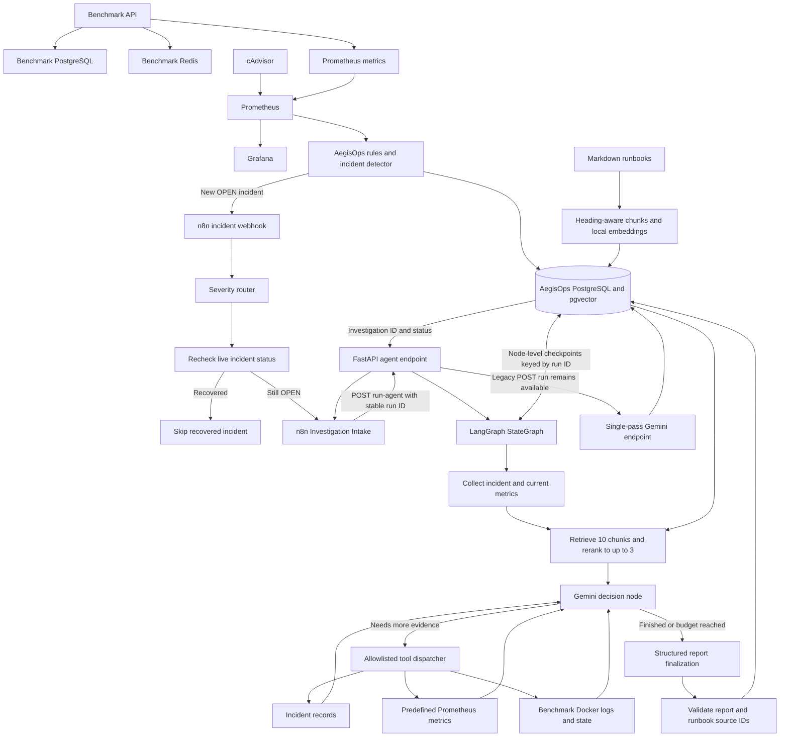

# AegisOps

AegisOps is a modular AI-powered incident operations platform being built to detect service failures, investigate evidence, identify root causes, request human approval for remediation, execute permitted recovery actions, verify recovery, and generate reusable postmortems.

The project is being developed incrementally so each architectural layer is understood before higher-level orchestration and AI reasoning are added.

> **Current status:** Phase 10 complete — LangGraph Investigation Agent
> **Next phase:** Phase 11 — Human-in-the-Loop Remediation
> **Roadmap:** 11 of 21 phases complete (Phases 0–10)

---

## Current Architecture



The benchmark environment is deliberately separate from the AegisOps core. It produces controlled failures and telemetry; AegisOps consumes that telemetry and stores its own incident state independently.

Benchmark, database and monitoring services are managed by the root `docker-compose.yml`. During local development, AegisOps FastAPI and the existing npm-based n8n instance run on Windows. The local embedding model and cross-encoder support retrieval; PostgreSQL with pgvector stores runbooks and investigations. Phase 10 now integrates the allowlisted Phase 9 tools into a checkpointed LangGraph agent. The existing single-pass investigation endpoint remains available, while the n8n Investigation Intake sub-workflow calls the new `run-agent` endpoint.

---

## Completed Phases

| Phase | Status | Outcome |
|---|---|---|
| Phase 0 — Project Foundation | ✅ Complete | Git/GitHub, FastAPI, PostgreSQL, pgvector, Docker, Compose, configuration, DB connectivity |
| Phase 1 — Benchmark Environment | ✅ Complete | Breakable FastAPI target with dedicated PostgreSQL, Redis, real operations, and controlled failures |
| Phase 2 — Monitoring & Telemetry | ✅ Complete | Prometheus, cAdvisor, Grafana, HTTP metrics, latency, 5xx rate, dependency health, container telemetry |
| Phase 3 — Incident Detection Engine | ✅ Complete | Prometheus ingestion, deterministic rules, severity, incident persistence, deduplication, automatic resolution |
| Phase 4 — Advanced Workflow Orchestration | ✅ Complete | Production webhook, severity routing, live incident recheck, timed handling, retries, recovery skip, and shared investigation intake |
| Phase 5 — LLM Investigation v1 | ✅ Complete | Gemini structured hypotheses, Prometheus evidence snapshot, PostgreSQL report history, n8n investigation hand-off |
| Phase 6 — Embeddings & Knowledge Base | ✅ Complete | CPU-based 384-dimensional embeddings, pgvector schema, duplicate-safe sample/Markdown ingestion and six stored documents |
| Phase 7 — RAG Pipeline | ✅ Complete | Heading-aware runbook chunks, 384-dimensional chunk embeddings, top-3 pgvector retrieval, Gemini context and validated source references |
| Phase 8 — Reranking & Context Engineering | ✅ Complete | Local cross-encoder reranking, duplicate-free context, excerpt budget and saved similarity/rerank scores |
| Phase 9 — Tool Calling Layer | ✅ Complete | Read-only incident/metric/log tools, validated allowlists, bounded Gemini tool-call loop and controlled multi-tool investigation |
| Phase 10 — LangGraph Investigation Agent | ✅ Complete | Stateful evidence and RAG, conditional Gemini/tool loop, PostgreSQL checkpointing, budget-aware structured report persistence and verified n8n integration |
| Phase 11 — Human-in-the-Loop Remediation | ⏳ Next | Approval-gated remediation proposals; no unattended destructive actions |

Detailed phase documentation is available under:

```text
docs/phases/
```

---

## Phase 2 — Monitoring Foundation

Phase 2 established the telemetry layer that Phase 3 now consumes.

The Grafana dashboard provides visibility into dependency availability, HTTP throughput, HTTP 5xx rate, and P95 request latency.


This monitoring layer remains intentionally separate from incident reasoning. Prometheus is the source of time-series data, while Grafana is used for human visualization.

---

## Phase 3 — Telemetry Becomes Incidents

Phase 3 connects the AegisOps core directly to Prometheus.

The detector currently evaluates four rule types:

```text
PostgreSQL unavailable
Redis unavailable
HTTP 5xx rate elevated
P95 latency elevated
```

During verification, Grafana showed the same underlying telemetry AegisOps was consuming: a benchmark PostgreSQL outage and recovery, controlled error traffic, and artificial latency.


The important separation is:

```text
Prometheus = telemetry source
Grafana    = visualization
AegisOps   = incident detection and state
```

---

## Phase 3 — Incident Lifecycle

Triggered rules become durable PostgreSQL incident records with severity, timestamps, trigger values, thresholds, and state.

AegisOps updates an existing open incident instead of generating duplicate records on every polling cycle.


The verified lifecycle is:

```text
healthy telemetry
      ↓
threshold crossed
      ↓
OPEN incident
      ↓
condition persists
      ↓
same incident updated
      ↓
telemetry recovers
      ↓
RESOLVED
```

This is still deterministic detection, not AI diagnosis. Root-cause reasoning is intentionally reserved for later phases.

---

## Phase 4 — Real Incident Orchestration

AegisOps now notifies n8n **once when an incident is created**, rather than starting another execution on every detection poll. The published n8n workflow routes by AegisOps-assigned severity and checks the authoritative incident state before continuing.

HIGH and CRITICAL incidents are rechecked immediately. MEDIUM and LOW incidents wait 30 seconds and then recheck. Both branches use the same `Still Open?` decision, so recovered incidents cannot enter investigation intake.

### Recovered incident — skip path

The recovered-incident execution below shows a previously resolved HIGH Redis incident passing through the immediate GET and shared IF check. n8n takes the FALSE output and explicitly records `SKIPPED_RECOVERED`; investigation intake does not run.


### Active incident — investigation intake

A fresh Redis outage created a new HIGH incident and automatically started the production n8n workflow. The live GET returned OPEN, so the TRUE output prepared a normalized incident context and called the reusable **AegisOps Investigation Intake** sub-workflow.


The intake initially registered normalized incident context; Phase 5 has since extended it with a backend-managed Gemini investigation call. See the [Phase 4 implementation and verification notes](docs/phases/phase-04-workflow-orchestration.md).

---

## Phase 5 — Evidence-Grounded LLM Investigation

AegisOps now turns a still-open incident into a structured **preliminary investigation**. The FastAPI endpoint retrieves the incident and a current Prometheus metric snapshot, asks Gemini to assess the evidence and stores the validated result. The model is asked for observations, hypotheses, missing evidence and suggested checks, not a definitive root cause.

### Automated Gemini invocation

The Phase 4 **AegisOps Investigation Intake** sub-workflow now runs the backend investigation endpoint. Severity routing, recovery checks and human-readable incident history remain outside the model; the API manages evidence collection, structured output and persistence.


### Structured report and evidence

For the Redis outage, the collected snapshot reported Redis as unavailable (`0.0`) while PostgreSQL remained available (`1.0`). Gemini separated those observations from possible causes and returned `LOW` confidence because Redis logs and container status were not available. This avoids presenting a dependency-health metric as proof of a specific failure mechanism.

The successful n8n execution returned investigation `2` for incident `12`, with the Gemini model, evidence timestamp and structured report. Both the manually generated and n8n-triggered reports are stored in PostgreSQL.


Saved investigations can now be retrieved through `GET /investigations/{investigation_id}` and `GET /investigations/by-incident/{incident_id}` without another Gemini call. The evidence collector currently produces **investigation-time snapshots**, not historical reconstruction at incident detection.

Read the [Phase 5 implementation and verification notes](docs/phases/phase-05-llm-investigation.md) for the full API contract, persistence design and test evidence.

---

## Phase 6 — Embeddings & Knowledge Base

Phase 6 adds a local knowledge store **without prematurely connecting it to Gemini**. SentenceTransformers generates normalized 384-dimensional vectors using `all-MiniLM-L6-v2`; the existing AegisOps PostgreSQL instance stores each vector with its original text, stable source key, model name and JSONB metadata.

### Embedding experiment

Before building persistence, we measured cosine similarity for the query *"The backend cannot connect to Redis"*. The Redis troubleshooting document scored `0.6564`, versus `0.1260` for the latency document and `0.0595` for PostgreSQL. This established a basic semantic ranking independently of the database; these scores are not relevance probabilities.

### File-based knowledge ingestion

The existing `seed_knowledge` script now reuses the same embedding and upsert modules as `ingest_runbooks`. Three Markdown runbooks cover Redis availability, benchmark PostgreSQL availability and API latency. A unique `source_key` makes repeated ingestion update existing documents instead of creating duplicate logical records.

### PostgreSQL verification

The screenshot below shows the **six verified records**: three sample documents and three file-backed runbooks. Every stored vector has 384 dimensions.


The runbooks remain initial procedures for the controlled benchmark. Phase 7 extends this foundation with chunk embeddings and retrieval. See the [Phase 6 implementation and verification notes](docs/phases/phase-06-embeddings-knowledge-base.md).

---

## Phase 7 — RAG Pipeline

Phase 7 connects the previously standalone knowledge base to the Phase 5 investigator. Each runbook is split at Markdown headings, with long sections capped at approximately 100 words and 20 words of overlap. The 12 resulting chunks are embedded locally using the same 384-dimensional MiniLM model and stored in `knowledge_chunks`, linked to their source documents.

### Semantic retrieval — relevant runbook sections

For a Redis-unavailability incident, AegisOps embeds a query derived from the incident title and affected service. PostgreSQL's pgvector cosine-distance operator ranks runbook chunks and returns the three closest matches with their titles, headings, content and source IDs. The saved retrieval below returned Redis Symptoms (`0.8407`), Potential Causes (`0.7321`) and Investigation (`0.6563`). These are similarity scores, not probabilities of a correct diagnosis.


### Gemini context and source validation

The existing investigation endpoint adds the retrieved excerpts to its Prometheus evidence before requesting a structured Gemini report. Its saved evidence records the retrieval query and exact chunks supplied to the model. Gemini can return `runbook_source_ids`; AegisOps checks that every returned ID belongs to the retrieved set before accepting the report.


The verification accepted both `runbook:redis-availability#chunk-10` and `runbook:redis-availability#chunk-11`. This confirms that the references correspond to retrieved material; it does **not** independently prove that every claim in the generated report is supported by the cited runbook. Per-claim attribution and more advanced ranking are future improvements.

Read the [Phase 7 implementation and verification notes](docs/phases/phase-07-rag-pipeline.md) for schema, ingestion, retrieval SQL, Gemini integration, limitations and test results.

---

## Phase 8 — Reranking & Context Engineering

Phase 8 adds a local cross-encoder after pgvector retrieval. In the Redis verification query, reranking moved the Investigation section from third place to first, demonstrating a more task-focused ordering than vector similarity alone.

### Before and after reranking

The first screenshot compares the embedding search against the reranked results for a Redis troubleshooting question.


### Selected context for Gemini

The context builder retains up to three unique chunks within a 2,400-character excerpt budget and preserves both similarity and rerank scores. The saved PostgreSQL investigation below confirms the strategy `vector_search_then_reranking` and a runbook source ID returned by Gemini.


See [Phase 8 implementation and verification](docs/phases/phase-08-context-engineering.md).

---

## Phase 9 — Controlled Tool Calling

Phase 9 gives Gemini a **separate, read-only investigation prototype** for requesting additional evidence instead of stopping after its first hypotheses. The experiment uses a fixed dispatcher that validates tool names and arguments before performing any operation. It does not modify the production `POST /investigations/{incident_id}/run` endpoint or the published n8n orchestration yet.

### Bounded evidence gathering

The final test investigated resolved PostgreSQL incident 13 and completed three successful, allowlisted calls: `get_incident(13)`, `get_metric(postgresql_unavailable)`, and `get_service_logs(benchmark-postgresql)`. The experiment enforces a maximum of three execution rounds and six tool calls.


### Evidence-based final report and limitations

Gemini used the incident record, current PostgreSQL metric and benchmark database logs to produce its final report. The historical incident was **RESOLVED** and the current metric reported **UP**. A temporal-grounding issue was discovered: the report called recovery "self-resolved" even though the inspected container logs were from *after* the incident resolution timestamp. The prompt was amended to forbid unsupported claims about past recovery; that safeguard has not yet been retested.


See [Phase 9 implementation, security controls and verification](docs/phases/phase-09-tool-calling-layer.md). Phase 10 subsequently integrated the allowlisted dispatcher into a checkpointed LangGraph graph.

---

## Phase 10 — Checkpointed LangGraph Investigation Agent

Phase 10 replaces the manually managed tool loop with an explicit, stateful investigation graph. The graph collects incident evidence, retrieves and reranks runbooks, lets Gemini request additional evidence through allowlisted read-only tools, and then validates and persists a structured report. Tool execution remains bounded at three rounds and six calls.

### LangGraph execution and saved report

The independent graph test investigated resolved PostgreSQL incident **13**, preserving events across nodes and tool rounds. Its finalization node saved structured investigation **7**, including runbook source references. This screenshot demonstrates node sequencing and report persistence rather than merely showing an LLM answer.


### n8n-to-LangGraph integration

The published main workflow routed a fresh **HIGH** Redis incident through its live OPEN-state check to the existing Investigation Intake sub-workflow. That workflow called the checkpointed `run-agent` FastAPI endpoint; the resulting structured investigation **9** was retrieved through the API and linked to incident **15**. Its saved evidence contained all three successful read-only tool calls and the `vector_search_then_reranking` retrieval strategy.


The second screenshot is the Investigation Intake execution you saved locally; place it at the indicated path. PostgreSQL checkpointing was separately verified by loading the **same checkpoint ID in two Python processes**. A repeated request using a completed `run_id` returned the **same investigation ID** without starting a new run. When the evidence-gathering budget was exhausted, the agent generated a qualified `COMPLETED_WITH_LIMIT` report instead of looping indefinitely.

See [Phase 10 implementation and verification](docs/phases/phase-10-langgraph-investigation-agent.md).

---

## Repository Structure

```text
AegisOps/
│
├── backend/
│   ├── app/
│   │   ├── core/
│   │   │   └── config.py
│   │   ├── db/
│   │   │   └── database.py
│   │   ├── incidents/
│   │   │   ├── __init__.py
│   │   │   ├── detector.py
│   │   │   ├── manager.py
│   │   │   ├── repository.py
│   │   │   ├── routes.py
│   │   │   ├── rules.py
│   │   │   └── worker.py
│   │   ├── monitoring/
│   │   │   ├── __init__.py
│   │   │   └── prometheus.py
│   │   ├── orchestration/
│   │   │   ├── __init__.py
│   │   │   └── n8n.py
│   │   ├── investigations/
│   │   │   ├── __init__.py
│   │   │   ├── agent.py
│   │   │   ├── evidence.py
│   │   │   ├── gemini_client.py
│   │   │   ├── repository.py
│   │   │   ├── routes.py
│   │   │   ├── schemas.py
│   │   │   └── tools.py
│   │   ├── knowledge/
│   │   │   ├── chunking.py
│   │   │   ├── embeddings.py
│   │   │   └── repository.py
│   │   └── main.py
│   ├── sql/
│   │   ├── 001_create_incidents.sql
│   │   ├── 002_create_investigations.sql
│   │   ├── 003_create_knowledge_documents.sql
│   │   └── 004_create_knowledge_chunks.sql
│   ├── scripts/
│   │   ├── embedding_demo.py
│   │   ├── seed_knowledge.py
│   │   ├── ingest_runbooks.py
│   │   └── check_checkpoint.py
│   ├── tests/
│   ├── requirements.txt
│   └── requirements-dev.txt
│
├── benchmark/
│   ├── app/
│   │   └── main.py
│   ├── Dockerfile
│   └── requirements.txt
│
├── monitoring/
│   ├── prometheus.yml
│   └── grafana/
│       └── provisioning/
│           └── datasources/
│               └── prometheus.yml
│
├── docs/
│   ├── phases/
│   │   ├── phase-00-project-foundation.md
│   │   ├── phase-01-benchmark-environment.md
│   │   ├── phase-02-monitoring-telemetry.md
│   │   ├── phase-03-incident-detection-engine.md
│   │   ├── phase-04-workflow-orchestration.md
│   │   ├── phase-05-llm-investigation.md
│   │   ├── phase-06-embeddings-knowledge-base.md
│   │   ├── phase-07-rag-pipeline.md
│   │   ├── phase-08-context-engineering.md
│   │   ├── phase-09-tool-calling-layer.md
│   │   └── phase-10-langgraph-investigation-agent.md
│   ├── runbooks/
│   │   ├── redis-availability.md
│   │   ├── postgresql-availability.md
│   │   └── api-latency.md
│   └── screenshots/
│       ├── phase 2/
│       │   ├── grafana.png
│       │   └── stack-running.png
│       ├── phase 3/
│       │   ├── grafana.png
│       │   └── incidents.png
│       ├── phase 4/
│       │   ├── n8n, false.png
│       │   └── n8n, true.png
│       ├── phase 5/
│       │   ├── gemini.png
│       │   └── gemini-investigation-output.png
│       ├── phase 6/
│       │   └── knowledge-base.png
│       ├── phase 7/
│       │   ├── retrieval.png
│       │   └── rag-validation.png
│       ├── phase 8/
│       │   ├── reranking.png
│       │   └── context-engineering.png
│       ├── phase 9/
│       │   ├── tool-calls.png
│       │   └── investigation-report.png
│       └── phase 10/
│           ├── langgraph-execution.png
│           └── n8n-integration.png
│
├── n8n-workflows/            # Add actual n8n exports before committing
├── .env.example
├── .gitignore
├── docker-compose.yml
└── README.md
```

---

## Core Technologies

### Current

- Python 3.12
- FastAPI
- Uvicorn
- PostgreSQL 16
- pgvector
- Redis
- psycopg
- httpx
- Docker
- Docker Compose
- Prometheus
- cAdvisor
- Grafana
- n8n (existing local npm installation)
- Gemini (`google-genai`, structured JSON output)
- Pydantic report validation
- Validated read-only Gemini tool dispatcher
- LangGraph StateGraph with conditional edges
- PostgreSQL checkpointing (`langgraph-checkpoint-postgres`)
- SentenceTransformers (`all-MiniLM-L6-v2`, CPU)
- NumPy (cosine-similarity experiment)
- pgvector Python adapter (`pgvector.psycopg`)

### Planned Later
- Slack / Discord notifications where useful
- AWS
- Terraform

Technologies are introduced only when their phase has a real architectural need.

---

## AegisOps Backend

Current core endpoints include:

```text
GET  /health
GET  /ready
GET  /incidents
POST /incidents/detect
GET  /incidents/{incident_id}
POST /investigations/{incident_id}/run
POST /investigations/{incident_id}/run-agent?run_id={uuid}
GET  /investigations/{investigation_id}
GET  /investigations/by-incident/{incident_id}
```

`/health` confirms that the FastAPI process is alive.

`/ready` confirms that the AegisOps backend can reach its own PostgreSQL dependency.

`GET /incidents` returns stored incident history, while `GET /incidents/{incident_id}` returns the latest state for an individual incident; n8n calls the latter before deciding whether to investigate.

`POST /incidents/detect` manually runs one detection cycle for testing and debugging. Normal detection is performed automatically by the background worker.

`POST /investigations/{incident_id}/run` remains the original single-pass Gemini investigation endpoint for OPEN incidents. `POST /investigations/{incident_id}/run-agent?run_id={uuid}` uses the checkpointed LangGraph workflow; a stable run ID enables checkpoint reuse and prevents a completed run from being re-executed on an identical request. The two GET investigation endpoints expose saved full reports and per-incident history without additional model calls. The new agent endpoint has been tested independently against a resolved incident and end to end from n8n against an OPEN Redis incident; it is not yet production hardened for overlapping concurrent retries or exactly-once report writes.

---

## Incident Detection Rules

Current deterministic rules:

| Rule | Threshold | Severity |
|---|---:|---|
| PostgreSQL unavailable | dependency value `== 0` | HIGH |
| Redis unavailable | dependency value `== 0` | HIGH |
| HTTP 5xx rate high | `> 0.05 req/s` | MEDIUM |
| API P95 latency high | `> 2.0 s` | MEDIUM |

Rules define measurable unhealthy conditions. They do not hardcode root-cause conclusions.

---

## Incident State & Deduplication

The current incident lifecycle is intentionally small:

```text
OPEN
RESOLVED
```

A fingerprint based on:

```text
service + rule_key
```

identifies an active incident.

Example:

```text
benchmark-redis:redis_unavailable
```

While that incident remains open, future detection cycles update `last_seen_at` and the current trigger value instead of inserting duplicates.

A database-level partial unique index reinforces the same invariant.

---

## Benchmark API

The benchmark environment currently exposes:

```text
GET  /health
GET  /ready
POST /items
GET  /items
GET  /activity
GET  /simulate/error
GET  /simulate/slow
GET  /metrics
```

The benchmark can currently simulate:

- PostgreSQL outage
- Redis outage
- HTTP 500 errors
- artificial API latency

These controlled failures provide known test conditions for AegisOps without coupling incident logic to a production application.

---

## Monitoring Metrics

Custom benchmark metrics include:

```text
benchmark_http_requests_total
benchmark_http_request_duration_seconds
benchmark_dependency_up
```

Prometheus also receives container telemetry through cAdvisor.

Prometheus scrapes:

```text
benchmark-api:8000/metrics
cadvisor:8080/metrics
```

AegisOps now queries Prometheus directly through its HTTP API for incident detection.

---

## Knowledge Base & RAG

Runbook ingestion and embeddings run locally against AegisOps PostgreSQL; ingestion does not require Gemini credentials or n8n. `knowledge_documents` holds full documents and `knowledge_chunks` holds embedded sections linked by `document_id`. Both use `VECTOR(384)` with the same SentenceTransformers model. Re-ingestion updates documents using stable `source_key` values and replaces obsolete chunks.

From `backend/`:

```powershell
python -m scripts.seed_knowledge
python -m scripts.ingest_runbooks
```

Verify stored dimensions using the existing Docker database:

```powershell
docker exec aegisops-postgres psql -U aegisops -d aegisops -c "SELECT source_key, source_type, vector_dims(embedding) AS dimensions FROM knowledge_documents ORDER BY id;"
```

The knowledge base contains **six documents** (three samples and three Markdown runbooks), with **12 embedded runbook chunks** across Symptoms, Investigation, Potential Causes and Recovery. The investigator now builds a query from the incident title and service, retrieves up to ten candidates with pgvector, reranks them and passes up to three curated excerpts to Gemini. The response's optional `runbook_source_ids` are validated against the retrieved IDs.

---

## Configuration

Important local configuration now includes:

```env
POSTGRES_PORT=5432
PROMETHEUS_URL=http://127.0.0.1:9090
INCIDENT_DETECTION_INTERVAL_SECONDS=10
N8N_INCIDENT_WEBHOOK_URL=http://127.0.0.1:5678/webhook/aegisops-incident
GEMINI_API_KEY=
GEMINI_MODEL=gemini-3.5-flash-lite
```

The shared PostgreSQL default remains `5432`. Developers can override it in their local `.env` when the port is already in use. Keep the real `GEMINI_API_KEY` only in the untracked `.env` file; never commit credentials or raw production logs.

---

## Local Services

Typical local endpoints:

```text
AegisOps backend      http://127.0.0.1:8000
Benchmark API         http://127.0.0.1:8001
cAdvisor              http://127.0.0.1:8080
Prometheus            http://127.0.0.1:9090
Grafana               http://127.0.0.1:3000
n8n (local npm)       http://127.0.0.1:5678
```

---

## Quick Start

Create a local environment file:

```powershell
Copy-Item .env.example .env
```

Start the Docker environment:

```powershell
docker compose up -d --build
```

Check service status:

```powershell
docker compose ps
```

Activate the backend environment and start FastAPI:

```powershell
cd backend
.\venv\Scripts\Activate.ps1
pip install -r requirements.txt
uvicorn app.main:app --reload
```

The incident detector starts automatically with FastAPI. Start the existing Windows n8n installation separately with `n8n`, open `http://127.0.0.1:5678`, and publish **AegisOps Incident Orchestration**. n8n and FastAPI currently share Windows localhost; moving either into a container requires reviewing the API and webhook URLs.

---

## Development Approach

AegisOps is intentionally being built phase by phase.

The project follows a few rules:

- introduce a technology only when a phase genuinely needs it
- keep the benchmark system separate from the AegisOps core
- avoid hardcoded diagnoses
- use deterministic logic where deterministic logic is the better tool
- keep remediation human-approved
- gather objective evidence before AI reasoning
- prefer meaningful end-of-phase verification over excessive micro-testing
- document each completed phase with architecture, verification evidence, lessons, and representative screenshots

---

## Documentation

Detailed implementation notes:

- [Phase 0 — Project Foundation](docs/phases/phase-00-project-foundation.md)
- [Phase 1 — Benchmark Environment](docs/phases/phase-01-benchmark-environment.md)
- [Phase 2 — Monitoring & Telemetry](docs/phases/phase-02-monitoring-telemetry.md)
- [Phase 3 — Incident Detection Engine](docs/phases/phase-03-incident-detection-engine.md)
- [Phase 4 — Advanced Workflow Orchestration](docs/phases/phase-04-workflow-orchestration.md)
- [Phase 5 — LLM Investigation v1](docs/phases/phase-05-llm-investigation.md)
- [Phase 6 — Embeddings & Knowledge Base](docs/phases/phase-06-embeddings-knowledge-base.md)
- [Phase 7 — RAG Pipeline](docs/phases/phase-07-rag-pipeline.md)
- [Phase 8 — Reranking & Context Engineering](docs/phases/phase-08-context-engineering.md)
- [Phase 9 — Tool Calling Layer](docs/phases/phase-09-tool-calling-layer.md)
- [Phase 10 — LangGraph Investigation Agent](docs/phases/phase-10-langgraph-investigation-agent.md)

---

## Current Milestone

The verified end-to-end workflow is now:

```text
Controlled benchmark outage
        ↓
Prometheus + deterministic detection rules
        ↓
Durable OPEN incident in AegisOps PostgreSQL
        ↓
n8n severity routing and live OPEN-state recheck
        ↓
Investigation Intake calls checkpointed FastAPI run-agent endpoint
        ↓
LangGraph collects incident evidence and reranked runbooks
        ↓
Gemini decides whether additional evidence is needed
        ↓
Allowlisted incident / metric / benchmark log tools
        ↓
Gemini continues or reaches a bounded tool budget
        ↓
Structured report generation and runbook source validation
        ↓
Investigation and evidence persisted in PostgreSQL
        ↓
n8n receives the investigation ID
```

**End-to-end verification:** A fresh HIGH Redis outage created incident **15**; n8n reached Investigation Intake; the LangGraph agent ran its allowed incident, metric and service-log tools; and the resulting saved investigation **9** was retrieved through the API. Its termination was `TOOL_BUDGET_REACHED`, producing a qualified report rather than claiming certainty about an unproven root cause.

Checkpoint recovery is verified across distinct Python processes, and repeated requests with a finished run ID return the existing saved report. This is **not yet exactly-once execution** under concurrent retries or crashes between final report persistence and the following checkpoint. The current agent is read-only; no automated remediation has been authorized or implemented.

**Next: Phase 11 — Human-in-the-Loop Remediation.** The streamlined roadmap has **21 total phases**, with Phases 0–10 complete. Export the main and intake n8n workflows to `n8n-workflows/` from the local instance; screenshots are verification evidence, not executable workflow definitions.
