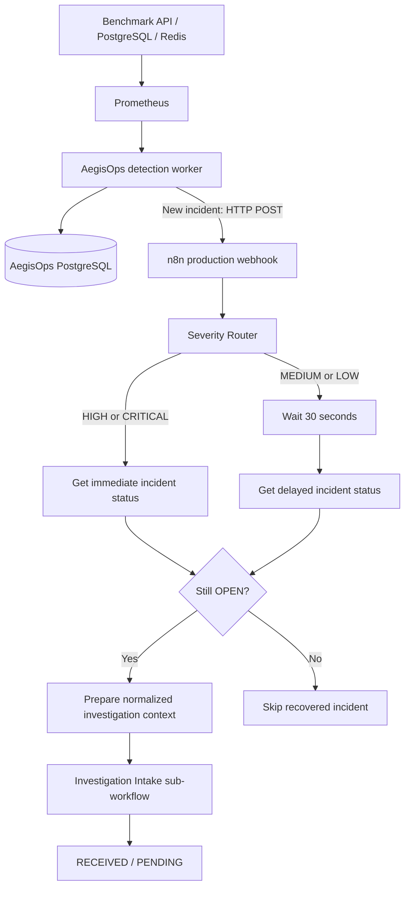

# Phase 4 — Advanced Workflow Orchestration

**Status:** Complete for the current local integration milestone
**Stack:** n8n (local npm), FastAPI, PostgreSQL, Prometheus, HTTP webhooks
**Next:** Phase 5 — LLM Investigation v1

## Objective

Phase 3 established when an incident exists and owns its persistent state. Phase 4 adds an event-driven orchestration layer: when a *new* incident is recorded, AegisOps starts an n8n workflow, selects an appropriate timing path, checks the current incident state, and either sends an active incident to a shared investigation intake or explicitly skips a recovered incident.

n8n coordinates the workflow. It does **not** detect failures, assign severity, determine root cause, or perform remediation. Those responsibilities remain with the AegisOps detector or later investigation/remediation phases.

## Architecture



The benchmark and monitoring services use Docker Compose. During Phase 4, FastAPI and n8n run on the Windows host, with n8n launched from the existing npm installation. The main workflow's production webhook is:

```text
POST http://127.0.0.1:5678/webhook/aegisops-incident
```

The webhook URL is configurable through `N8N_INCIDENT_WEBHOOK_URL`. Containerizing n8n later is a deployment change, not a workflow redesign.

## Backend integration

AegisOps persists an incident *before* notifying n8n. The notification runs only in the `CREATED` branch of `backend/app/incidents/manager.py`; repeated `UPDATED` polling cycles do not generate new workflow executions. Resolution events are not sent to n8n in the current implementation.

The notification client is `backend/app/orchestration/n8n.py`. It sends a JSON payload containing the incident ID, rule key, title, service, severity, OPEN status, trigger value, and threshold. HTTP delivery errors are logged rather than rolling back the incident database transaction.

```text
CREATE → commit incident → POST n8n webhook
UPDATE → update existing OPEN incident; no POST
RESOLVE → persist RESOLVED state; no POST yet
```

**Reliability boundary:** The initial notification is a best-effort HTTP call. If n8n is offline when AegisOps sends it, the incident remains in PostgreSQL, but there is no durable notification queue or automatic redelivery yet. A transactional outbox and retry worker are future hardening work, not functionality delivered in Phase 4.

### API used by n8n

`GET /incidents/{incident_id}` returns the latest incident record. Both immediate and delayed workflow paths use it rather than trusting the original webhook's OPEN status, which might already be outdated.

The backend remains authoritative for `OPEN` and `RESOLVED` state. n8n's recovery-skip node records the routing decision *inside that workflow execution*; it does not change the database.

## n8n workflow

The main workflow is named **AegisOps Incident Orchestration**. The separate reusable workflow is named **AegisOps Investigation Intake**.

### Event entry and severity routing

A production POST webhook accepts a newly created incident. A Switch node reads `body.severity` and exposes CRITICAL, HIGH, MEDIUM, and LOW outputs. Severity is assigned by AegisOps rules, not by n8n.

| Detection rule | Configured severity |
|---|---|
| `postgresql_unavailable` | HIGH |
| `redis_unavailable` | HIGH |
| `http_5xx_rate_high` | MEDIUM |
| `api_latency_high` | MEDIUM |

At this milestone, no automatic detector rule emits CRITICAL or LOW. Their n8n branches are in place for future rules.

### Immediate and delayed handling

HIGH and CRITICAL incidents make an immediate GET request for current incident status. MEDIUM and LOW incidents first wait 30 seconds, then make their GET request. The delay allows short-lived lower-severity conditions to recover before starting a later, more expensive investigation.

Both HTTP Request nodes have **Retry On Fail** configured for three attempts with 2,000 ms between attempts. If all attempts fail, the current workflow stops with an error; it does not mark the incident resolved or silently treat missing data as healthy.

Both GET responses share one **Still Open?** IF node. Since they return the same incident schema, no duplicate status-check logic is needed.

### Active incident: shared investigation intake

An `OPEN` incident passes through **Prepare Investigation**, which produces a normalized incident context with these fields:

```text
incident_id, rule_key, title, service, severity,
status, trigger_value, threshold,
handling_mode, orchestration_stage
```

The `handling_mode` is calculated from severity: HIGH/CRITICAL is `IMMEDIATE`; MEDIUM/LOW is `DELAYED`. The stage is `INVESTIGATION_READY`.

Both paths call **AegisOps Investigation Intake**. Its sub-workflow trigger accepts all incoming fields and its registration node adds:

```text
intake_status = RECEIVED
investigation_state = PENDING
```

The intake does not yet call a language model. It is the shared hand-off point for Phase 5.

### Recovered incident: explicit skip

An incident whose current status is no longer `OPEN` goes to **Skip Recovered Incident**, a terminal Edit Fields node. It keeps the incident details and adds:

```text
orchestration_stage = SKIPPED_RECOVERED
handling_mode = IMMEDIATE or DELAYED
skip_reason = Incident recovered before investigation
```

This makes avoided investigations visible in n8n's execution history. It does not erase the original incident or alter its stored status.

## Verification evidence

### Recovered HIGH incident — skip rather than investigate

A previously resolved Redis incident was submitted through the production webhook. The HIGH branch fetched the current incident state and the shared IF node chose FALSE. **Skip Recovered Incident** executed; the investigation preparation and shared intake did not.


This shows why fetching the current state matters: a previously OPEN webhook payload should not force investigation after AegisOps has already recorded recovery.

### Fresh HIGH incident — hand-off to investigation intake

A fresh benchmark Redis outage created a new `redis_unavailable` incident. AegisOps dispatched the production webhook, the HIGH branch fetched the live OPEN incident, the shared IF node chose TRUE, and **Prepare Investigation** successfully invoked the shared intake workflow.


Earlier execution output also confirmed the intake fields `RECEIVED` and `PENDING` for the immediate path. The final one-IF wiring was verified on both recovered and active HIGH incidents. The delayed TRUE/FALSE logic was exercised earlier, before consolidation into the final shared-IF layout; a separate final-layout delayed-to-intake execution is not represented by these two screenshots.

## Failure discovered and corrected

Initial integration reached PostgreSQL but not n8n because the new `create_incident()` and notification block had accidentally been indented beneath the `return` for an already-open incident. Moving that block outside `if open_incident` restored the intended CREATED → webhook behavior.

A separate transient PostgreSQL `database system is starting up` exception occurred during a background cycle. The detection worker logged the error and continued; later API requests succeeded. This was not an n8n connectivity failure.

## Workflow export and portability

The n8n instance currently runs through npm on the developer PC and also hosts Sentinel workflows. The two AegisOps workflows are separate from Sentinel.

To include reproducible workflow definitions in the repository, download each workflow as JSON from its n8n workflow menu and save it as:

```text
n8n-workflows/aegisops-incident-orchestration.json
n8n-workflows/aegisops-investigation-intake.json
```

Export **both** workflows. Their JSON files cannot be reconstructed reliably from screenshots; add the actual exports from n8n before committing. After import on another machine, confirm the sub-workflow reference, webhook URL, API base address, and any credentials. This documentation package contains the Markdown and screenshots, not a fabricated workflow export.

## Boundaries and next steps

- No AI investigation, diagnosis, remediation, or recovery-verification action is implemented yet.
- The current webhook is unauthenticated and bound to local development; protect it before any public or cloud deployment.
- Delivery from AegisOps to n8n is best effort; durable event delivery remains future hardening.
- CRITICAL and LOW branches are ready for rules, but no detector rules currently produce those severities.
- Phase 5 will consume the normalized `INVESTIGATION_READY` payload and replace the sub-workflow's placeholder PENDING state with real structured LLM investigation.

**Phase 4 result:** An actual newly created incident can start a production n8n execution, follow severity-specific timing, check authoritative incident state, skip recovered conditions, or enter a reusable investigation workflow. The supplied screenshots demonstrate both final immediate-path outcomes.
