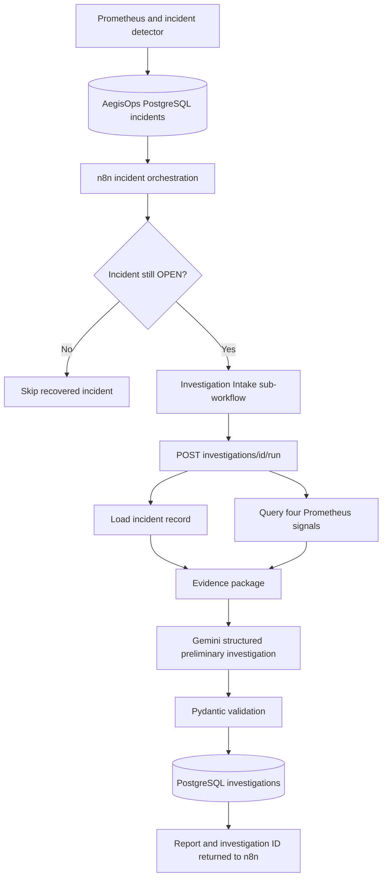

# Phase 5 — LLM Investigation v1

**Status:** Complete (3 October 2026) · **Stack:** FastAPI, Gemini (`google-genai`), Pydantic, Prometheus, PostgreSQL, n8n · **Next:** Phase 6 — Embeddings & Knowledge Base

## Objective

Phase 4 delivered a reliable routing decision: an incident that is still `OPEN` reaches a shared n8n Investigation Intake; a recovered incident is skipped. Phase 5 attaches a real LLM investigation to that intake. AegisOps gathers incident records and live monitoring evidence, requests a structured preliminary investigation from Gemini, validates the response, and stores the evidence and report in PostgreSQL.

The LLM produces **hypotheses and recommended checks**, not a confirmed root cause or an automatic remediation action. Incident detection and severity assignment remain deterministic.

## Architecture and responsibilities



- **n8n:** triggers and coordinates the investigation after the Phase 4 status check. It does not hold the Gemini key or decide the incident's severity.
- **FastAPI:** collects evidence, calls Gemini, validates the structured result, persists it, and exposes read-only history endpoints.
- **Gemini:** evaluates observations, proposes possible causes, identifies missing evidence and recommends follow-up checks.
- **PostgreSQL:** stores the incident's original context, the investigation-time evidence snapshot and the generated report.

## Implementation

The backend adds a dedicated `backend/app/investigations/` package:

| Module | Responsibility |
|---|---|
| `schemas.py` | Pydantic schemas for the structured report and hypotheses |
| `gemini_client.py` | Gemini request, JSON output and response validation |
| `evidence.py` | Incident lookup and Prometheus evidence collection |
| `repository.py` | Persist and retrieve completed investigations |
| `routes.py` | Run, detail and history API endpoints |

Database changes are defined in `backend/sql/002_create_investigations.sql`. The new `investigations` table links to `incidents`, and keeps model name, evidence collection time, `JSONB` evidence, `JSONB` report and creation time. Multiple investigations of the same incident are retained rather than overwritten.

The local configuration uses `GEMINI_API_KEY` and `GEMINI_MODEL`. The key belongs only in the untracked `.env` file; `.env.example` contains an empty key placeholder.

## Evidence and output contract

The collector combines the selected incident record with a **current metric snapshot** of the four Phase 3 signals: Redis health, PostgreSQL health, HTTP 5xx rate and P95 request latency. Each signal is explicitly tagged `AVAILABLE`, `NO_DATA` or `QUERY_ERROR`; unavailable data is not presented as a healthy measurement.

The time distinction matters: `evidence_collected_at` records *when the model's evidence was collected*, which may be later than `first_detected_at`. A current metric reading alone cannot establish what caused a historical outage.

Pydantic enforces the response structure:

```text
summary
observations[]
hypotheses[]:
  cause
  supporting_evidence[]
  missing_evidence[]
recommended_checks[]
confidence: LOW | MEDIUM | HIGH
evidence_sufficient: boolean
```

For the controlled Redis incident, Gemini observed the Redis dependency gauge at `0.0` while PostgreSQL was `1.0`; HTTP 5xx and latency queries returned `NO_DATA`. It proposed a Redis process/container problem and connectivity problems as possible causes but did **not** claim to have confirmed either one. Its report specified missing logs, process status and direct connectivity checks, with `LOW` confidence and `evidence_sufficient = false`.

## Automated investigation through n8n

The existing Phase 4 main workflow still routes by severity, rechecks live incident status and skips incidents that have recovered. A still-open incident reaches the **AegisOps Investigation Intake** sub-workflow. The intake now calls `POST /investigations/{incident_id}/run` using its normalized `incident_id`.


This execution verifies the sub-workflow hand-off from n8n to the FastAPI investigation endpoint. The HTTP node returns the result of the backend-managed Gemini call; Gemini is not invoked by a separate n8n model node. The HTTP call currently has no automatic retry, avoiding accidental duplicate model invocations and persisted reports.

## Structured result and persistence

The successful n8n HTTP response includes the generated `investigation_id`, source `incident_id`, model, collection timestamp and structured investigation. The screenshot below captures the returned report rather than a manually composed example.


The stored reports are available independently of n8n through these endpoints:

| Endpoint | Response |
|---|---|
| `POST /investigations/{incident_id}/run` | Generate and persist a report for an `OPEN` incident |
| `GET /investigations/{investigation_id}` | Full saved report and its evidence snapshot |
| `GET /investigations/by-incident/{incident_id}` | Newest-first investigation history with summaries and confidence |

The read endpoints do not make another Gemini request. The history endpoint returns a compact list by default, while the detail endpoint supplies the full evidence package and report.

## Verification

A controlled Redis outage generated incident **12**. The first investigation was launched manually to verify the FastAPI-to-Gemini path; the second was launched through n8n. The PostgreSQL query confirmed two records:

| Investigation | Incident | Model | Invocation |
|---|---|---|---|
| 1 | 12 | `gemini-3.8-flash` | Manual API call |
| 2 | 12 | `gemini-3.8-flash` | n8n Investigation Intake |

The following checks passed:

- Evidence collection retrieved incident metadata and queried all four Prometheus signals.
- Gemini returned JSON conforming to the Pydantic investigation schema.
- The automated n8n sub-workflow completed the investigation HTTP call.
- PostgreSQL stored both the original evidence and generated reports.
- `GET /investigations/2` returned the saved report and evidence.
- `GET /investigations/by-incident/12` returned both investigations, newest first.

## Boundaries and next steps

Phase 5 uses a **single LLM call over a current evidence snapshot**. It does not yet provide historical metrics at detection time, Redis server logs, tool-driven follow-up, vector retrieval, LangGraph state, autonomous root-cause confirmation or remediation. An unsupported hypothesis must remain a hypothesis.

A failed notification or LLM request also does not yet have a durable end-to-end orchestration retry/outbox. Avoid adding automatic retries to the model call without an idempotency strategy.

**Next: Phase 6 — Embeddings & Knowledge Base.** Phase 6 introduces the storage and representation of operational knowledge; RAG and agent-driven retrieval are intentionally reserved for their later phases.
