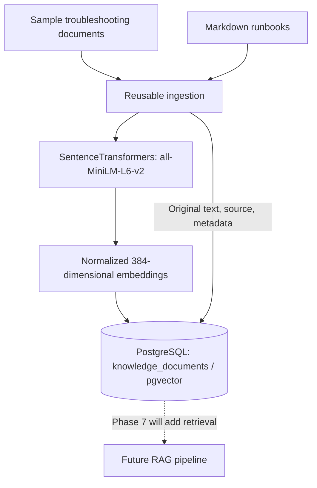

# Phase 6 — Embeddings & Knowledge Base

**Status:** Complete (3 October 2026) · **Stack:** Python, SentenceTransformers, NumPy, PostgreSQL, pgvector, psycopg · **Next:** Phase 7 — RAG Pipeline

## Objective

Phases 0–5 gave AegisOps a monitored benchmark, deterministic incident detection, n8n orchestration and an evidence-grounded Gemini investigator. Phase 6 creates a separate, persistent store for operational knowledge. It converts short runbooks and sample troubleshooting documents into numerical embeddings, then stores the original text, source information and vectors together in PostgreSQL.

This phase establishes the **representation, ingestion and storage** of knowledge. It deliberately does **not** retrieve documents for Gemini or claim that the LLM is using the knowledge base yet. Semantic retrieval, chunking and RAG begin in Phase 7.

## Architecture



**Input:** Short text documents and Markdown runbooks. **Output:** Duplicate-safe `knowledge_documents` records containing original content and a 384-dimensional embedding. **Caller:** Local ingestion scripts. **Downstream consumer:** The future RAG retriever; Phase 5's Gemini client is not yet connected to this database table.

The knowledge table lives in the existing **AegisOps PostgreSQL** database, not the deliberately breakable benchmark PostgreSQL database. It uses the pgvector extension already installed during the project foundation phase.

## 1. Embedding fundamentals

We first ran `backend/scripts/embedding_demo.py` independently of the database. It loaded the CPU-based `sentence-transformers/all-MiniLM-L6-v2` model, encoded one query and three sample documents, and normalized each embedding. With normalized vectors, the dot product equals cosine similarity.

**Test query:** "The backend cannot connect to Redis"

| Ranked document | Cosine similarity |
|---|---:|
| Troubleshooting Redis connection refusals and service outages | 0.6564 |
| Diagnosing elevated HTTP latency and slow API responses | 0.1260 |
| How to investigate PostgreSQL replication and database failures | 0.0595 |

The experiment produced **four embeddings, each with 384 dimensions**. The Redis document ranked highest despite differing wording. Similarity scores express the model's representation of closeness; they are not probabilities of correctness or proof that a document is authoritative.

The model is downloaded from Hugging Face on its first run and cached locally. An unauthenticated Hub request warning did not prevent this test from completing; an `HF_TOKEN` is optional for this local experiment.

## 2. PostgreSQL knowledge schema

The schema is defined in `backend/sql/003_create_knowledge_documents.sql` and enables the `vector` extension if needed. The table's principal fields are:

| Column | Purpose |
|---|---|
| `source_key` | Unique, stable document identifier used for duplicate-safe upserts |
| `title`, `content` | Human-readable original knowledge |
| `source_type` | Distinguishes `sample_runbook` from `runbook` |
| `embedding_model` | Records the model used to generate the vector |
| `embedding VECTOR(384)` | Stores the 384-dimensional representation |
| `metadata JSONB` | Stores source-specific details, such as file path and environment |
| `created_at`, `updated_at` | Creation and latest-ingestion timestamps |

The Python `pgvector` adapter registers the vector type on the existing psycopg connection. PostgreSQL stores embeddings beside their source text, so later retrieval can return both the matched vector's document and its provenance.

## 3. Reusable embedding and ingestion code

The initial proof-of-concept ingestion script embedded three hardcoded troubleshooting documents. We then extracted the reusable logic into two small modules, keeping the existing project structure rather than adding extra layers:

| Path | Responsibility |
|---|---|
| `backend/app/knowledge/embeddings.py` | Cache the local model and generate normalized text/query embeddings |
| `backend/app/knowledge/repository.py` | Upsert documents, metadata and vectors through the existing database connection |
| `backend/scripts/seed_knowledge.py` | Load the three controlled sample documents |
| `backend/scripts/ingest_runbooks.py` | Read Markdown runbooks and reuse the same upsert function |

The embedding model is cached with `lru_cache`, avoiding repeated model initialization within a process. The repository uses `INSERT ... ON CONFLICT (source_key) DO UPDATE`, so ingesting an existing document updates its content and embedding rather than inserting another logical copy.

The scripts run from the backend directory as Python modules:

```powershell
python -m scripts.seed_knowledge
python -m scripts.ingest_runbooks
```

## 4. File-based operational runbooks

Three short runbooks are stored in `docs/runbooks/`:

| File | Operational topic |
|---|---|
| `redis-availability.md` | Redis status, logs, connectivity and recovery verification |
| `postgresql-availability.md` | Benchmark PostgreSQL readiness, logs, configuration and connectivity |
| `api-latency.md` | P95 latency, endpoint performance, dependency health and resource checks |

The file-based ingestion script reads the Markdown, derives the title from the first heading, assigns a stable `runbook:<filename-stem>` source key and stores the source path in metadata. All three runbooks are initial procedures for the **controlled benchmark**, not exhaustive production recovery policies. Any actual remediation still requires the later approval and verification phases.

## 5. Persistence verification

The final PostgreSQL query showed **six logical documents**: three initial sample entries and three Markdown runbooks. Every stored vector had 384 dimensions.


This screenshot verifies persisted content and embedding dimensionality. The earlier embedding experiment supplies separate evidence of meaningful similarity ranking; the database screenshot alone does not prove retrieval quality.

The six confirmed source keys are:

```text
sample:redis
sample:postgresql
sample:api-latency
runbook:redis-availability
runbook:api-latency
runbook:postgresql-availability
```

Re-running sample ingestion retained document IDs `1`, `2` and `3`. Later database IDs skipped some numbers because PostgreSQL sequences can advance even when an insert encounters a conflict and performs an update. Gaps in IDs are not duplicate documents.

To inspect the local knowledge base:

```powershell
docker exec aegisops-postgres psql -U aegisops -d aegisops -c "SELECT id, source_key, source_type, vector_dims(embedding) AS dimensions FROM knowledge_documents ORDER BY id;"
```

## Engineering decisions and boundaries

- **Local model:** SentenceTransformers runs on CPU with no required paid embedding API. Normalized vectors can be compared with cosine similarity.
- **Model consistency:** The model name is stored with every vector. A future model change will require considering dimension and embedding-space compatibility rather than blindly mixing representations.
- **Metadata and provenance:** Document content is kept alongside source keys and file paths so later retrieved excerpts can be traced back to their runbooks.
- **Idempotent ingestion:** Stable source keys avoid duplicate logical documents across repeated runs.
- **No premature retrieval layer:** This phase is about generating and persisting knowledge, not wiring it into the investigation endpoint.

**Current limitation:** Each short Markdown runbook is embedded as one text input. The embedding model has an input-length limit, so longer documents could be truncated. We have not yet implemented chunking, vector search, relevance evaluation or RAG. The existing Phase 5 Gemini investigator continues to use live incident and Prometheus evidence only.

## Result and next phase

Phase 6 delivers a functioning local embedding model, measured semantic similarity, a PostgreSQL `VECTOR(384)` schema, reusable duplicate-safe ingestion and a small file-backed operational knowledge base.

**Next: Phase 7 — RAG Pipeline.** We'll split longer runbooks into searchable chunks, retrieve relevant passages from pgvector and supply only appropriately sourced context to Gemini.
