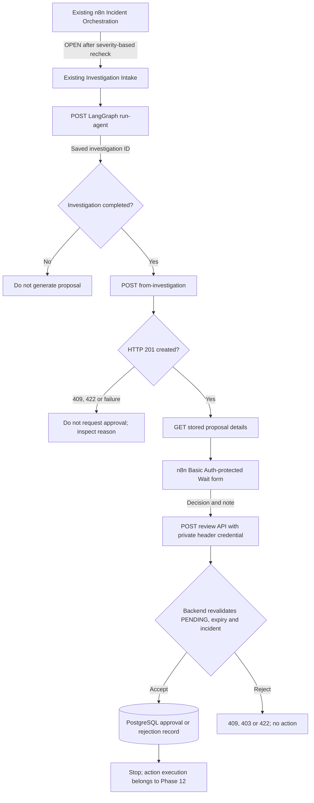

# Phase 11 — Human-in-the-Loop Remediation

**Status:** Core implementation complete and end-to-end approval/rejection paths verified

**Previous:** Phase 10 — LangGraph Investigation Agent

**Next:** Phase 12 — Automated Remediation

## Objective

Transform saved LangGraph investigations into **auditable recovery proposals that require a human decision**. AegisOps must limit recovery candidates to a small backend-controlled catalog, reject proposals for resolved incidents, maintain a durable review history, and accept authenticated `APPROVED` or `REJECTED` decisions without performing infrastructure changes. Extend the two existing n8n workflows rather than introducing a third.

This is an **authorization phase, not an execution phase**. An approval is a stored decision about an exact action and target; it does not run a Docker command or prove that the proposed recovery will work.

## Architecture and ownership

**Division of responsibility:** LangGraph provides the investigation report; FastAPI owns action allowlists, incident/investigation validation and review state; PostgreSQL stores the proposal and audit fields; n8n presents the form and transports the human decision. The backend—not a model, form or workflow branch—is authoritative on approval eligibility.

## Implementation

### 11.1 — Allowlisted action catalog and persistence

`backend/app/remediation.py` declares frozen `RemediationAction` records. The initial catalog deliberately targets **benchmark services only**:

| Action key | Incident service | Compose service | Risk |
|---|---|---|---|
| `restart_benchmark_redis` | `benchmark-redis` | `benchmark-redis` | MEDIUM |
| `restart_benchmark_postgresql` | `benchmark-postgresql` | `benchmark-db` | HIGH |
| `restart_benchmark_api` | `benchmark-api` | `benchmark-api` | MEDIUM |

`target_service` follows AegisOps incident naming, while `compose_service` identifies the Docker Compose component; for PostgreSQL they intentionally differ. The catalog is metadata in Phase 11—not an executable command interface.

`backend/sql/005_create_remediation_proposals.sql` introduces `remediation_proposals` with incident and investigation foreign keys, exact action and target, rationale, expected outcome, risk, `PENDING`/`APPROVED`/`REJECTED`/`EXPIRED`/`CANCELLED` status, 24-hour expiration, reviewer label, review timestamp and note. The schema checks supported action/target pairs and creates a partial unique index over `(incident_id, action_key)` for pending proposals.

The SQL migration was applied to the existing **AegisOps core PostgreSQL** container, separate from the breakable benchmark PostgreSQL container.

### 11.2–11.4 — Proposal creation from a saved investigation

`backend/app/remediation_routes.py` provides:

| Method and path | Responsibility |
|---|---|
| `POST /remediations/proposals` | Validate an explicitly supplied candidate against the catalog, OPEN incident and matching investigation |
| `GET /remediations/proposals/{proposal_id}` | Retrieve stored proposal details |
| `POST /remediations/from-investigation/{investigation_id}` | Build the current benchmark availability candidate from a stored investigation and call the same validated creation path |

The creation transaction locks the incident, requires `OPEN`, checks an exact service/action match, and verifies that the investigation belongs to the incident. Pending proposals that have expired can be marked `EXPIRED` before replacement; an active duplicate results in HTTP `409`. A proposal cannot be created from a missing investigation or a resolved incident.

The **initial** `from-investigation` policy deterministically selects `restart_benchmark_redis` or `restart_benchmark_postgresql` from the incident's service and uses the saved report summary as its rationale. It does not use free-form model-generated commands, infer that restart is always correct, or automatically propose an API restart for every API symptom. Actual effectiveness remains to be verified.

**Safety tests:** Historical incidents **13** (PostgreSQL) and **15** (Redis) were `RESOLVED`; attempts to create fresh recovery proposals for resolved incidents were rejected. A separate controlled PostgreSQL outage produced incident **16** and investigation **10**, from which AegisOps stored proposal **1** as HIGH-risk `PENDING` with action `restart_benchmark_postgresql` and a 24-hour review window.

### 11.5 — Authenticated backend review and audit trail

Added `POST /remediations/proposals/{proposal_id}/review` with a required `X-AegisOps-Review-Key` header, matched against `REMEDIATION_REVIEW_KEY` from the local untracked `.env`. The request requires `APPROVED` or `REJECTED`, a reviewer label and a review note.

The review transaction locks the incident first and then the proposal, consistent with proposal creation. It accepts a decision only for an unexpired `PENDING` proposal; `APPROVED` additionally requires the incident to remain `OPEN`. A completed or expired proposal cannot be approved again. Rejected or invalid requests cannot trigger execution because no execution endpoint is implemented in this phase.

**Verified rejection:** Proposal **1**, linked to incident **16**, was saved as `REJECTED` with reviewer `local-operator` and the note *Controlled test completed; benchmark database restored.* The response included the review timestamp.

### 11.6–11.9 — Extend the existing n8n Investigation Intake

The main **AegisOps Incident Orchestration** workflow retains severity routing, active-state recheck and call to the existing **AegisOps Investigation Intake** sub-workflow. Rather than adding a separate approval workflow, Investigation Intake was extended after `Run LangGraph Investigation`:

1. `Investigation Completed?` gates progression on a saved investigation ID. During troubleshooting, the final IF comparison used a numeric `investigation_id > 0` check to avoid n8n Boolean/string coercion; the backend still independently validates the investigation and OPEN incident.
2. `Generate Remediation Proposal` calls the `from-investigation` endpoint. The HTTP node includes response status and does not treat non-2xx replies as successful approvals.
3. `Proposal Created?` continues only on HTTP `201`; recovered incidents or duplicate/unsupported proposals do not enter human review.
4. `Fetch Proposal Details` retrieves the stored action, target, risk, rationale and expected outcome.
5. `Wait for Human Approval` pauses for a **Basic Auth-protected form submission**, requiring `APPROVED` or `REJECTED` and an explanatory note. The configured 23-hour wait is shorter than the proposal's 24-hour database expiration.
6. `Submit Review Decision` uses a private n8n Header Auth credential to call the FastAPI review endpoint. HTTP response status is preserved so a `409` or credential failure can be distinguished from a successful record update.

The first end-to-end attempt correctly saved LangGraph **investigation 11 for incident 17** but failed on an n8n IF string/Boolean mismatch. Retries showed the item incorrectly reaching False even when status was `COMPLETED_WITH_LIMIT`. Switching the IF node to numeric saved-investigation-ID comparison routed one item through True **without an extra Gemini call**. This was a workflow type-handling error, not a LangGraph failure.

#### Final n8n workflow

The following screenshot documents the existing Investigation Intake sub-workflow extended with proposal generation, a creation-status gate, proposal retrieval, a human approval wait and review submission. The parent severity router was not rebuilt.

#### Human approval form

The human-facing form presents the proposed action and the information needed for review, requires a decision and note, and uses Basic Auth credentials distinct from the backend review API's header key. The current reviewer string (`local-operator`) is a local test audit label rather than a cryptographically authenticated person.

### 11.10 — Verified approval path

A real Redis availability test produced **incident 17** and **investigation 11**, with `COMPLETED_WITH_LIMIT` after three successful read-only diagnostic calls. Proposal generation saved **proposal 2**, target `benchmark-redis`, action `restart_benchmark_redis`, risk `MEDIUM`, and status `PENDING`. n8n progressed through all nodes, paused for the form and resumed after the operator selected `APPROVED` with a note.

`Submit Review Decision` returned **HTTP 200 OK**. Its response recorded proposal **2**, incident **17**, action `restart_benchmark_redis`, status `APPROVED`, `reviewed_by=local-operator`, `reviewed_at=2026-10-04T13:22:07.054483+00:00`, and the review note *Controlled Phase 11 approval test. No remediation execution authorized yet.* This confirms the database-backed authorization trail and successful end-to-end integration, not command execution.

## Verified results

| Test | Result |
|---|---|
| Catalog contains only three benchmark restart candidates | Verified by definition and API use |
| Resolved incident receives no new proposal | Correctly rejected |
| New OPEN incident plus matching saved investigation | Proposal 1 created and persisted |
| HIGH-risk PostgreSQL action reviewed | Proposal 1 saved as `REJECTED` |
| Investigation Intake reaches proposal creation and wait | Verified after IF type-handling fix |
| Basic Auth-protected form resumes n8n execution | Verified |
| Redis proposal is approved through the review API | Proposal 2 saved as `APPROVED`, HTTP 200 |
| Recovery action executed as part of approval | **No — deliberately deferred to Phase 12** |

## Safety boundaries and remaining work

- **No automated execution yet.** Stored `APPROVED` is authorization data, not an imperative to execute blindly. Phase 12 must check the latest incident state, exact action, target, expiration/authorization semantics and live service health immediately before any permitted action.
- **Shared local reviewer identity.** Basic Auth restricts access to the n8n form, while the FastAPI key authorizes review submission. The `reviewer` field is supplied by the workflow, not derived from individual authenticated identities. Stronger RBAC and per-person audit identities remain hardening work.
- **Candidate selection is deliberately simple.** The service-to-action policy and saved investigation summary produce an inspectable proposal; model-generated remediation commands and uncertain root-cause assumptions are not trusted.
- **Form URLs are retrieved manually.** Automatically delivering an approval link was discussed but not implemented or verified in this phase. Signed URLs and secrets must not appear in public screenshots, logs or versioned exports.
- **Expiration and timeout are distinct.** The database enforces a 24-hour proposal window when review requests arrive. A dedicated n8n timeout/notification/abandonment branch, secret rotation, concurrent review idempotency and automatic reconciliation after recovery are future operational hardening tasks.
- **Workflow exports are still required.** Screenshots document behavior but are not importable workflows; export both published n8n workflow JSON definitions before final portfolio packaging. Unpin any local mock investigation output before live operation.

## Operator closeout checklist

- [ ] Verify Redis and PostgreSQL benchmark containers were restored after testing
- [ ] Verify incident 17 has transitioned to `RESOLVED` after Redis recovery
- [ ] Unpin `Run LangGraph Investigation` test data and clear mock execution state
- [ ] Save and publish both existing n8n workflows
- [ ] Export the actual n8n workflow JSON files and keep credentials excluded
- [ ] Confirm `docs/screenshots/phase 11/` contains `auth_form.png` and `updated_n8n_workflow.png`
- [ ] Confirm `.env` and review credentials remain untracked; run `git diff --check`

The screenshot files above are **already saved locally under those exact names**; this Markdown file references them rather than embedding or renaming them.

## Result and next phase

Phase 11 creates a complete **investigation → controlled proposal → explicit human decision → audited PostgreSQL outcome** path in the existing n8n architecture. Its most important constraint is also its defining guarantee: neither the model nor the approval form can initiate infrastructure changes through the Phase 11 API.

**Next: Phase 12 — Automated Remediation.** Begin with a narrowly scoped, dry-run-capable executor for benchmark services. Verify approvals and incident state again just before executing an exact allowlisted action, prevent duplicate execution on retries, record execution results and ensure human review cannot be bypassed. Phase 13 then handles independent recovery verification.
