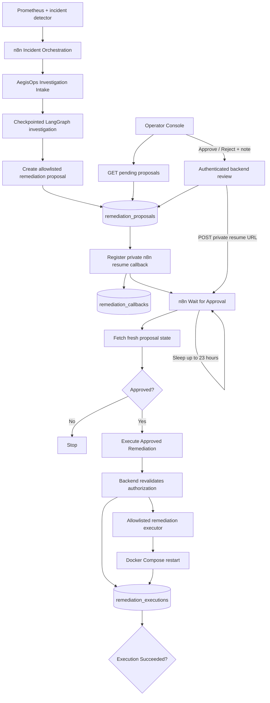

# Phase 12 — Automated Remediation

**Status:** Implementation complete; approval/callback flow, controlled execution, persistence, and idempotency verified

**Previous:** Phase 11 — Human-in-the-Loop Remediation

**Next:** Phase 13 — Recovery Verification

## Objective

Turn a human-approved remediation proposal into a **real, controlled infrastructure action** without allowing Gemini, n8n, or the browser to supply arbitrary commands.

The governing rule for this phase is:

```text
AI proposes.
Human approves.
Backend validates.
Backend executes only a predefined action.
```

Phase 12 proves that AegisOps can execute an approved remediation command safely and audibly. It does **not** yet prove that the affected service recovered. Independent post-action recovery verification belongs to Phase 13.

## Architecture



### Ownership

- **Gemini / LangGraph** investigates evidence and produces a structured report.
- **FastAPI** owns the action catalog, proposal state, review validation, callback registry, execution authorization, and execution endpoint.
- **PostgreSQL** stores proposals, callback audit state, and remediation executions.
- **n8n** orchestrates the workflow and sleeps while waiting for a human decision.
- **Operator Console** is the current human interface. It is intentionally a thin client of backend APIs; Phase 15 can replace this temporary UI without redesigning the backend or n8n approval architecture.
- **Docker Compose** performs the fixed benchmark-service restart selected by backend code.

## 12.1 — Controlled remediation executor

`backend/app/remediation.py` contains the backend-controlled remediation catalog and execution function.

The model never returns a shell command for execution. Instead, the workflow refers to an action key such as:

```text
restart_benchmark_redis
```

The backend maps that key to a predefined Compose target such as:

```text
benchmark-redis
```

The executor uses a fixed argument list with `subprocess.run(...)`. It does not use `shell=True`, and neither Gemini nor n8n can provide arbitrary command text.

The initial benchmark actions remain deliberately narrow:

| Action key | Incident service | Compose service | Risk |
|---|---|---|---|
| `restart_benchmark_redis` | `benchmark-redis` | `benchmark-redis` | MEDIUM |
| `restart_benchmark_postgresql` | `benchmark-postgresql` | `benchmark-db` | HIGH |
| `restart_benchmark_api` | `benchmark-api` | `benchmark-api` | MEDIUM |

The distinction between logical incident service and Compose service is intentional. In particular, `benchmark-postgresql` is the incident-facing service name, while `benchmark-db` is the Compose service.

## 12.2 — Remediation execution audit

Migration:

```text
backend/sql/006_create_remediation_executions.sql
```

introduced `remediation_executions`.

Important fields include:

```text
id
proposal_id
incident_id
action_key
target_service
status
started_at
finished_at
exit_code
output
error
```

Execution status currently uses:

```text
RUNNING
SUCCEEDED
FAILED
```

`proposal_id` is unique. That provides the core idempotency guarantee:

```text
one proposal
→ at most one remediation execution record
```

The backend first creates the `RUNNING` audit row, then releases the database transaction before running Docker. After the command finishes, the audit row is finalized as `SUCCEEDED` or `FAILED`.

This avoids holding a database transaction open while an external command runs.

## 12.3 — Protected execution endpoint

The execution endpoint is:

```text
POST /remediations/proposals/{proposal_id}/execute
```

and requires:

```text
X-AegisOps-Execution-Key
```

The execution credential is deliberately separate from the review credential:

```text
REMEDIATION_REVIEW_KEY
REMEDIATION_EXECUTION_KEY
```

Approval authority and execution authority are different capabilities.

For a **new** execution, the backend validates:

- the proposal exists
- the associated incident exists
- proposal status is `APPROVED`
- the authorization has not expired
- the incident is still `OPEN`
- the action exists in `REMEDIATION_CATALOG`
- the stored target matches the catalog target
- the proposal has not already executed

Only after these checks can the fixed executor run.

### Idempotent replay behavior

An important ordering issue was discovered during testing.

Originally, the endpoint checked whether the incident was still `OPEN` before checking for an existing execution. After Redis recovered, repeating the same request returned:

```text
Cannot execute remediation for a resolved incident.
```

even though the request should have been treated as a harmless replay.

The endpoint was corrected so that it checks for an existing execution **before** applying the live-state checks used for a new action:

```text
existing execution?
        ↓
YES → return existing row with reused=true
        ↓
NO
        ↓
validate approval + expiry + OPEN incident
        ↓
execute
```

This allows retries after recovery without running the infrastructure action twice.

## 12.4 — Human approval moved out of the n8n form

The original Phase 11 implementation used an n8n `Wait` form. During Phase 12 testing, the form's signed runtime URL proved awkward to surface reliably from the editor.

Rather than coupling the eventual Phase 15 dashboard to n8n internals, the approval design was changed to a backend-owned contract.

The current temporary interface is:

```text
GET /operator
```

protected with HTTP Basic authentication using:

```text
OPERATOR_CONSOLE_USERNAME
OPERATOR_CONSOLE_PASSWORD
```

The console polls:

```text
GET /remediations/proposals?status=PENDING
```

and displays proposal details including:

- incident title and severity
- proposal ID and incident ID
- action key
- target service
- risk level
- investigation rationale
- expected outcome
- authorization expiration
- review note
- Approve / Reject controls

The browser does **not** receive `REMEDIATION_REVIEW_KEY` or `REMEDIATION_EXECUTION_KEY`.

The console submits its decision to a backend-owned operator route, which internally reuses the existing protected review logic.

This means Phase 15 can replace the temporary HTML interface with a proper frontend while keeping the backend API and n8n orchestration unchanged.

## 12.5 — Callback-driven n8n wait

Migration:

```text
backend/sql/007_create_remediation_callbacks.sql
```

introduced `remediation_callbacks`.

Important fields:

```text
proposal_id
resume_url
registered_at
resumed_at
```

The n8n resume URL is treated as a private orchestration capability. It is **not** returned by the normal proposal APIs.

The Investigation Intake workflow now uses:

```text
Proposal Created?
        ↓
Register Approval Callback
        ↓
Wait for Approval
        ↓
Fetch Proposal Details
        ↓
Review Approved?
        ↓
Execute Approved Remediation
        ↓
Execution Succeeded?
```

`Wait for Approval` uses n8n's webhook-based wait behavior rather than the old form-submission behavior.

Before entering the wait, n8n registers:

```text
{{ $execution.resumeUrl }}
```

with:

```text
POST /remediations/proposals/{proposal_id}/callback
```

using the existing execution credential.

The backend accepts only local n8n callback URLs for the current development topology.

The wait remains bounded to **23 hours**, while proposal authorization remains bounded by the database expiration window.

### Review and resume sequence

When the operator approves or rejects:

```text
Operator Console
        ↓
backend validates operator credentials
        ↓
backend validates PENDING proposal and expiry
        ↓
backend stores APPROVED or REJECTED
        ↓
database transaction commits
        ↓
backend POSTs stored n8n resume URL
        ↓
n8n wakes
        ↓
Fetch Proposal Details reads authoritative state
```

Committing the review before waking n8n prevents a race where the workflow could resume and still observe `PENDING`.

The callback audit then records `resumed_at`.

If the review is stored successfully but the callback request fails, the API reports:

```text
workflow_resumed = false
```

rather than pretending the human decision was never saved. Retry/reconciliation for that failure case remains a hardening concern.

## 12.6 — n8n execution gate

After the webhook wait resumes, `Fetch Proposal Details` performs a fresh backend read.

`Review Approved?` continues only when the backend-authoritative proposal status is `APPROVED`.

The TRUE branch calls:

```text
Execute Approved Remediation
```

which invokes the protected execution endpoint using the **AegisOps Execution Key** n8n credential.

`Execution Succeeded?` checks both:

```text
HTTP statusCode == 200
AND
body.status == "SUCCEEDED"
```

This separates:

```text
the HTTP request returned
```

from:

```text
the remediation command completed successfully
```

During integration, `Fetch Proposal Details` was changed to include the full HTTP response. That changed the proposal ID path from:

```text
$json.id
```

to:

```text
$json.body.id
```

The execution node initially still referenced the old path, so no `remediation_executions` row was created during that run. The expression was corrected to use the proposal ID from `body.id`.

This was an n8n data-shape bug, not a backend execution failure.

## 12.7 — Controlled Redis verification

A fresh Redis outage produced:

```text
Incident: 19
Proposal: 4
Action: restart_benchmark_redis
Target: benchmark-redis
Risk: MEDIUM
```

The temporary Operator Console displayed proposal `4` as a pending human review.

The operator submitted:

```text
APPROVED
Phase 12 dashboard approval callback test
```

PostgreSQL recorded:

```text
status      = APPROVED
reviewed_by = aegisops-operator
```

and the callback record contained a non-null `resumed_at`, confirming that the backend successfully woke the waiting n8n execution.

### n8n callback and execution path


This screenshot demonstrates the new callback-based approval architecture and the active remediation branch. The backend remains authoritative on approval state; n8n no longer depends on a human finding a generated form URL.

### Successful Redis restart and execution record

The corrected backend execution request for proposal `4` created remediation execution `2`:

```text
status    = SUCCEEDED
exit_code = 0
reused    = False
```

Docker reported the benchmark Redis container restarting and starting, and `docker compose ps benchmark-redis` showed the container healthy after the command.


The database contained exactly one execution row for proposal `4`.

A repeated execution request returned the existing execution with:

```text
reused = True
```

and did not create a second row or run the restart again.

## Verified results

| Test | Result |
|---|---|
| Unsupported/free-form command path available to Gemini | **No** |
| Execution uses backend allowlist | Verified |
| Review and execution use separate credentials | Verified |
| Expired historical approval can execute later | Correctly rejected |
| Pending proposals appear in Operator Console | Verified |
| Browser receives backend review/execution secret | **No** |
| n8n callback is registered privately | Verified |
| Human review is persisted before workflow resume | Verified |
| Callback audit stores `resumed_at` | Verified |
| Approved Redis action executes through backend | `SUCCEEDED`, exit code `0` |
| Redis restart command starts benchmark Redis | Verified |
| Execution is persisted in `remediation_executions` | Verified |
| Duplicate execute request creates another row | **No** |
| Duplicate execute request reruns Docker action | **No** |
| Duplicate execute request returns `reused=true` | Verified |

## Important verification note

The controlled incident revealed the n8n proposal-ID expression problem described above. The callback and review path was exercised on the real incident, while the corrected execution endpoint was then verified against the same approved proposal without another Gemini investigation.

Before final public/portfolio packaging, one fresh post-fix end-to-end incident run is recommended to capture the entire corrected chain in a single execution. The individual Phase 12 boundaries have been verified, but this note avoids overstating what the existing screenshot alone proves.

## Safety boundaries

Phase 12 maintains the following guarantees:

1. Gemini cannot execute arbitrary shell commands.
2. n8n cannot provide arbitrary shell commands.
3. Remediation actions are allowlisted in backend code.
4. Human approval is required before a new execution.
5. The backend remains authoritative after human approval.
6. Approval and execution use separate credentials.
7. Expired approval cannot authorize a new action.
8. A resolved incident cannot receive a new remediation execution.
9. Proposal target must match the backend action catalog.
10. A proposal can create at most one execution record.
11. Repeated execution requests return the existing audit record.
12. The private n8n resume URL is not exposed through the dashboard proposal feed.
13. Browser code does not contain the backend remediation keys.
14. The Docker command runs outside the database transaction.

## Known limitations

### Command success is not recovery verification

Phase 12 may claim:

> AegisOps successfully executed the human-approved remediation command.

It may **not** yet claim:

> AegisOps independently verified that the affected service recovered.

A Docker exit code of `0` proves the restart command completed successfully. It does not independently prove that:

- Prometheus returned to normal
- dependency health remained stable
- the incident's original rule cleared
- the service stayed healthy after a bounded wait
- recovery did not introduce another failure

Those checks belong to Phase 13.

### Callback retry hardening

If the human decision commits but n8n is temporarily unreachable, the proposal is already `APPROVED` or `REJECTED`, while `workflow_resumed=false`.

A dedicated safe callback retry/reconciliation mechanism should be considered during hardening rather than weakening proposal review idempotency.

### External command / audit split

If Docker completes successfully but PostgreSQL becomes unavailable before the execution row can be finalized, the command may have run while final audit persistence fails.

The endpoint reports this condition clearly. Stronger distributed exactly-once execution semantics are intentionally deferred.

### Docker progress on stderr

Docker Compose can write normal progress messages such as `Restarting` and `Started` to stderr even when `exit_code=0`. The current audit schema stores captured stderr in the `error` field, so that field should be interpreted together with execution status and exit code. A later cleanup may rename or normalize command streams.

### Temporary Operator Console

The current `/operator` UI exists to provide a usable human approval surface before Phase 15. Its backend contracts and callback architecture are intended to survive; the embedded HTML itself is not the final dashboard.

## Operator closeout checklist

- [x] Controlled Redis outage created a real incident
- [x] Pending remediation proposal appeared in Operator Console
- [x] Human approval was stored in PostgreSQL
- [x] n8n callback was registered and resumed
- [x] Controlled Redis restart executed successfully
- [x] Execution row stored `SUCCEEDED` with exit code `0`
- [x] Duplicate execution returned the existing record
- [x] Duplicate execution created no second execution row
- [x] Phase 12 screenshots saved
- [ ] Export the final published n8n workflow JSON after the latest node-expression fix
- [ ] Run `git diff --check`
- [ ] Commit and push Phase 12
- [ ] Optional before portfolio release: run one fresh post-fix end-to-end incident for a single-execution proof screenshot

## Result and next phase

Phase 12 turns AegisOps from a system that merely records human authorization into one that can carry out a narrowly scoped, audited infrastructure action.

The permanent approval architecture is now:

```text
backend-owned proposal state
        +
human-facing frontend
        +
private n8n callback
        +
bounded webhook wait
```

This prevents the eventual dashboard from depending on n8n form URLs or secrets.

**Next: Phase 13 — Recovery Verification.**

Phase 13 will independently determine whether the remediation actually restored the affected system by reusing the existing monitoring rules and Prometheus client, performing bounded post-action rechecks, recording recovery outcome, and distinguishing successful command execution from successful incident recovery.
